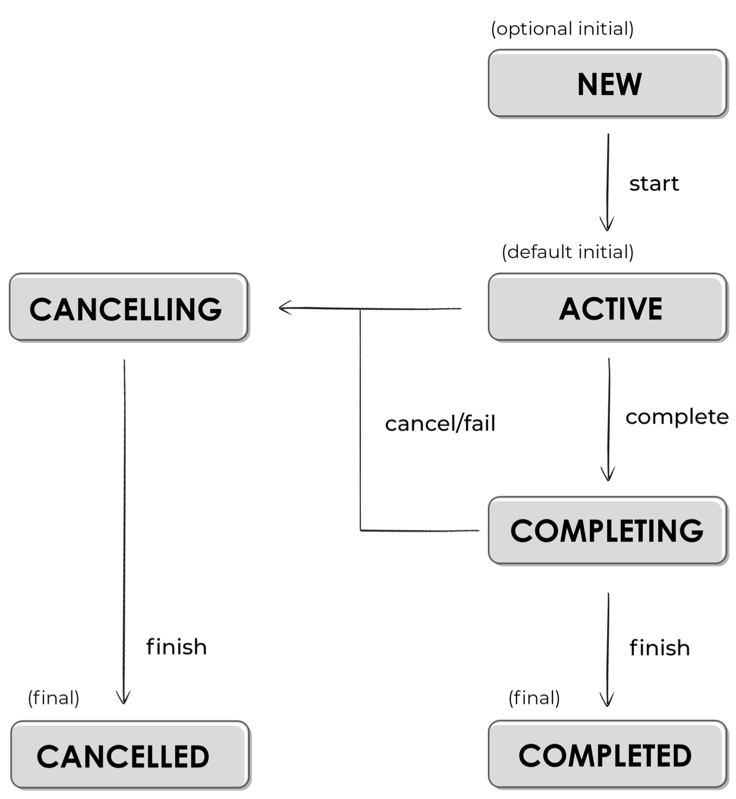
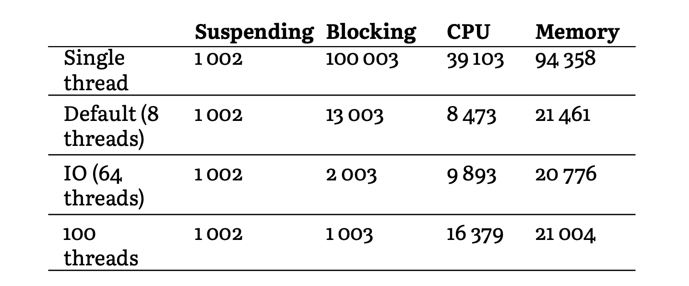

# Kotlin Coroutines Deep Dive

## Part 1: Understanding KotlinCoroutines

### Why Kotlin Coroutines?

Threads issues:

- There is no mechanism here to cancel these threads, so we
  often face memory leaks.
- Making so many threads is costly.
- Frequently switching threads is confusing and hard to manage.
- The code will unnecessarily get bigger and more complicated.

Callbacks:

- Getting data parallelized, is not so straightforward with callbacks
- supporting cancellation requires a lot of additional effort.
- The increasing number of indentations make this code hard to
  read (code with multiple callbacks is often considered highly
  unreadable). Such a situation is called “callback hell”.
- When we use callbacks, it is hard to control when things are triggered.

Rxjava/ReactiveStreams

- You need to learn different functions, like subscribeOn, observeOn, map, or subscribe,
- Cancelling needs to be explicit.
- Functions need to return objects wrapped inside Observable or Single classes.
- In practice, when we introduce RxJava, we need to reorganize our code a lot.

## Using Kotlin coroutines

core functionality is the ability to **suspend** a coroutine at some point and resume it in the future.
Suspended coroutine released the thread, so thread is not blocked!

`suspendCoroutine<Unit> {continuation ->  continuation.resume(Unit}`

suspendCoroutine needs to be called with resume to progress, otherwise it will always be suspended.

**Suspending a coroutine, not a function**

we suspend a coroutine, not a function. Suspending functions are not coroutines, just
functions that can suspend a coroutine.

## Coroutines under the hood

- suspend fun in reality are fun with additionally parameter at the end: continuation
- Suspending functions are like state machines, with a possible state at the beginning of the function and after each
  suspending function call.
- Both the number identifying the state and the local data are kept in the continuation object.
- Continuation of a function decorates a continuation of its caller function; as a result, all these continuations
  represent a call stack that is used when we resume or a resumed function completes.

## Part 2: Kotlin Coroutines library

### Coroutine builders

Suspend function can't be called from normal function, it can either be started in another suspended function or from
coroutine builder - bridge from the normal to the suspending world.

most common used:

- launch
- runBlocking
- async

**launch**
The way `launch` works is conceptually similar to starting a new `thread` (thread function)
`launch` is an extension function on the `CoroutineScope` interface. This is part of an important mechanism called
**structured concurrency**, whose purpose is to build a relationship between the parent coroutine and a child coroutine.
To some degree, how `launch` works is similar to a `daemon thread` but much cheaper.

```kotlin
fun main() {
    thread(isDaemon = true) {
        Thread.sleep(1000L)
        println("World!")
    }
    thread(isDaemon = true) {
        Thread.sleep(1000L) println ("World!")
    }
    thread(isDaemon = true) {
        Thread.sleep(1000L)
        println("World!")
    }
    println("Hello,")
    Thread.sleep(2000L)
}
```

```kotlin
fun main() {
    GlobalScope.launch {
        delay(1000L)
        println("World!")
    }
    GlobalScope.launch {
        delay(1000L)
        println("World!")
    }
    GlobalScope.launch {
        delay(1000L)
        println("World!")
    }
    println("Hello,")
    Thread.sleep(2000L)
}
```

**runBlocking builder** (currently rarely used)
`runBlocking` is a very atypical builder. It blocks the thread it has been started on whenever its `coroutine` is
suspended (similar to suspending main).
This means that `delay(1000L)` inside runBlocking will behave like `Thread.sleep(1000L)`:

```kotlin
fun main() {
    Thread.sleep(1000L)
    println("World!")
    Thread.sleep(1000L)
    println("World!")
    Thread.sleep(1000L)
    println("World!")
    println("Hello,")
}
```

```kotlin
fun main() {
    runBlocking {
        delay(1000L)
        println("World!")
    }
    runBlocking {
        delay(1000L)
        println("World!")
    }
    runBlocking {
        delay(1000L)
        println("World!")
    }
    println("Hello,")
}
```

Use cases in which `runBlocking` is used:

- main function, where we need to block the thread, because otherwise the program will end.
- unit tests, where we need to block the thread for the same reason.

**async builder**
Similar to `launch`, but produce a value.
The `async` function returns an object of type `Deferred<T>`, where `T` is the type of the produced value.
`Deferred` has a suspending method await, which returns this value once it is ready.
Just like the `launch` builder, `async` starts a coroutine immediately when it is called. So, it is a way to start a few
processes at once and then `await` all their results. The returned `Deferred` stores a value inside itself once it is
produced, so once it is ready it will be immediately returned from `await`. However, if we call `await` before the value
is
produced, we are suspended until the value is ready.

```kotlin
fun main() = runBlocking {
    val res1 = GlobalScope.async {
        delay(1000L)
        "Text 1"
    }
    val res2 = GlobalScope.async {
        delay(3000L)
        "Text 2"
    }
    val res3 = GlobalScope.async {
        delay(2000L)
        "Text 3"
    }
    println(res1.await())
    println(res2.await())
    println(res3.await())
}
```

How the `async` builder works is very similar to `launch`, but it has additional support for returning a value. If all
`launch` functions were replaced with `async`, the code would still work fine. But don’t do that! `async` is about
producing a
value, so if we don’t need a value, we should use `launch`.

```kotlin
fun main() = runBlocking {
// Don't do that!
// this is misleading to use async as launch 
    GlobalScope.async {
        delay(1000L)
        println("World!")
    }
    println("Hello,")
    delay(2000L)
}
```

The async builder is often used to parallelize two processes, such as obtaining data from two different places, to
combine them together.

```kotlin
scope.launch {
    val news = async {
        newsRepo.getNews()
            .sortedByDescending { it.date }
    }
    val newsSummary = newsRepo.getNewsSummary() // we could wrap it with async as well,
// but it would be redundant
    view.showNews(
        newsSummary,
        news.await()
    )
}
```

### Structured Concurrency

If a coroutine is started on `GlobalScope`, the program will not wait for it. As previously mentioned, coroutines do not
block any threads, and nothing prevents the program from ending. This is why, in the below example, an additional delay
at the end of `runBlocking` needs to be called if we want to see “World!” printed.

```kotlin
fun main() = runBlocking {
    GlobalScope.launch {
        delay(1000L)
        println("World!")
    }
    GlobalScope.launch {
        delay(2000L)
        println("World!")
    }
    println("Hello,")
    //    delay(3000L)
}

// Hello,
```

Why do we need this `GlobalScope` in the first place?
It is because launch and async are extension functions on `CoroutineScope`.
However, if you take a look at the definitions of these and of `runBlocking`, you will see that the
block parameter is a function type whose receiver type is also `CoroutineScope`.
This means we don't need `GlobalScope`, instead, `launch` can be called on the receiver provided by
`runBlocking`.

```kotlin
fun main() = runBlocking {
    this.launch { // same as just launch
        delay(1000L)
        println("World!")
    }
    launch { // same as this.launch
        delay(2000L)
        println("World!")
    }
    println("Hello,")
}
```

A parent provides a scope for its children, and they are called in this scope.
This builds a relationship that is called a structured concurrency.
Here are the most important effects of the parent-child relationship:

- children inherit context from their parent (but they can also overwrite)
- a parent suspends until all the children are finished
- when the parent is cancelled,its child coroutines are cancelled too
- when a child raises an error,it destroys the parent as well

Notice that, unlike other coroutine builders, runBlocking is not an extension function on CoroutineScope. This means
that it cannot be a child: it can only be used as a root coroutine (the parent of all the children in a hierarchy).
This means that runBlocking will be used in different cases than other coroutines. As we mentioned before, this is very
different from other builders.

### Coroutine context

CoroutineContext is conceptually similar to a map or a set collection. It is an indexed set of Element instances, where
each Element is also a CoroutineContext. Every element in it has a unique Key that is used to identify it. This way,
CoroutineContext is just a universal way to group and pass objects to coroutines. These objects are kept by the
coroutines and can determine how these coroutines should be running (what their state is, in which thread, etc).

**Adding contexts** - What makes CoroutineContext truly useful is the ability to merge two of them together.
When two elements with different keys are added, the resulting context responds to both keys.

```kotlin
fun main() {
    val ctx1: CoroutineContext = CoroutineName("Name1")
    println(ctx1[CoroutineName]?.name) // Name1 
    println(ctx1[Job]?.isActive) // null
    val ctx2: CoroutineContext = Job()
    println(ctx2[CoroutineName]?.name) // null 
    println(ctx2[Job]?.isActive) // true, because "Active" // is the default state of a job created this way
    val ctx3 = ctx1 + ctx2
    println(ctx3[CoroutineName]?.name) // Name1 
    println(ctx3[Job]?.isActive) // true
}
```

When another element with the same key is added, just like in a map, the new element replaces the previous one.

```kotlin
fun main() {
    val ctx1: CoroutineContext = CoroutineName("Name1")
    println(ctx1[CoroutineName]?.name) // Name1
    val ctx2: CoroutineContext = CoroutineName("Name2")
    println(ctx2[CoroutineName]?.name) // Name2
    val ctx3 = ctx1 + ctx2
    println(ctx3[CoroutineName]?.name) // Name2
}
```

**Subtracting elements** - Elements can also be removed from a context by their key using the minusKey function.

**Folding context** - If we need to do something for each element in a context, we can use the fold method, which is
similar
to fold for other collections.

### Coroutine context and builders

So CoroutineContext is just a way to hold and pass data. By default, the parent passes its context to the child, which
is one of the parent-child relationship effects. We say that the child inherits context from its parent.

Since new elements always replace old ones with the same key, the child context always overrides elements with the same
key from the parent context. The defaults are used only for keys that are not specified anywhere else. Currently, the
defaults only set `Dispatchers.Default` when no `ContinuationInterceptor` is set, and they only set `CoroutineId` when
the
application is in debug mode.
There is a special context called `Job`, which is mutable and is used to communicate between a coroutine’s child and its
parent.

**Accessing context in a suspending function**
Context is referenced by continuations, which are passed to each suspending function. So, it is possible to access a
parent’s context in a suspending function. To do this, we use the coroutineContext property, which is available in every
suspending scope.

```kotlin

suspend fun printName() {
    println(coroutineContext[CoroutineName]?.name)
}

suspend fun main() = withContext(CoroutineName("Outer")) {
    printName() // Outer
    launch(CoroutineName("Inner")) {
        printName() // Inner
    }
    delay(10)
    printName() // Outer
}
```

**Creating our own context**
It is not a common need, but we can create our own coroutine context pretty easily. To do this, the easiest way is to
create a class that implements the CoroutineContext.Element interface. Such a class needs a property key of type
CoroutineContext.Key<*>. This key will be used as the key that identifies this context. The common practice is to use
this class’s companion object as a key. This is how a very simple coroutine context can be implemented:

```kotlin
class MyCustomContext : CoroutineContext.Element {
    override val key: CoroutineContext.Key<*> = Key

    companion object Key : CoroutineContext.Key<MyCustomContext>
}
```

### job

Conceptually, a job represents a cancellable thing with a lifecycle. Formally, Job is an interface, but it has a
concrete contract and state, so it might be treated similarly to an abstract class.

A job lifecycle is represented by its state. Here is a graph of states and the transitions between them:


In the “Active” state, a job is running and doing its job. If the job is created with a coroutine builder, this is the
state where the body of this coroutine will be executed. In this state, we can start child coroutines. Most coroutines
will start in the “Active” state. Only those that are started lazily will start with the “New” state. These need to be
started in order for them to move to the “Active” state. When a coroutine is executing its body, it is surely in the
“Active” state. When it is done, its state changes to “Completing”, where it waits for its children. Once all its
children are done, the job changes its state to “Completed”, which is a terminal one. Alternatively, if a job cancels or
fails when running (in the “Active” or “Completing” state), its state will change to “Cancelling”. In this state, we
have the last chance to do some clean-up, like closing connections or freeing resources (we will see how to do this in
the next chapter). Once this is done, the job will
move to the “Cancelled” state.

Every coroutine builder from the Kotlin Coroutines library creates its own job. Most coroutine builders return their
jobs, so it can be used elsewhere. This is clearly visible for launch, where Job is an explicit result type.

There is a very important rule: Job is the only coroutine context that is not inherited by a coroutine from a coroutine.
Every coroutine creates its own Job, and the job from an argument or parent coroutine is used as a parent of this new
job.There is a very important rule:<br>
**Job is the only coroutine context that is not inherited by a coroutine from a
coroutine**.<br>
Every coroutine creates its own Job, and the job from an argument or parent coroutine is used as a parent
of this new job.
The parent can reference all its children, and the children can refer to the parent. This parent-child relationship (Job
reference storing) enables the implementation of cancellation and exception handling inside a coroutine’s scope.

Structured concurrency mechanisms will not work if a new Job context replaces the one from the parent. To see this, we
might use the Job() function, which creates a Job context (this will be explained later).

```kotlin
fun main(): Unit = runBlocking {
    launch(Job()) { // the new job replaces one from parent
        delay(1000)
        println("Will not be printed")
    }
}
// (prints nothing, finishes immediately)
```

In the above example, the parent does not wait for its children because it has no relation with them. This is because
the
child uses the job from the argument as a parent, so it has no relation to the runBlocking.
When a coroutine has its own (independent) job, it has nearly no relation to its parent. It only inherits other
contexts, but other results of the parent-child relationship will not apply. This causes us to lose structured
concurrency, which is a problematic situation that should be avoided.

The first important advantage of a job is that it can be used to wait until the coroutine is completed. For that, we use
the join method. This is a suspending function that suspends until a concrete job reaches a final state (either
Completed or Cancelled).

```kotlin
fun main(): Unit = runBlocking {
    val job1 = launch {
        delay(1000)
        println("Test1")
    }
    val job2 = launch {
        delay(2000)
        println("Test2")
    }
    job1.join()
    job2.join()
    println("All tests are done")
}
// (1 sec)
// Test1
// (1 sec)
// Test2
// All tests are done
```

The Job interface also exposes a children property that lets us reference all its children. We might as well use it to
wait until all children are in a final state.

```kotlin
val children = coroutineContext[Job]?.children
children?.forEach { it.join() }
println("All tests are done")
```

### Cancellation

Basic cancellation
The Job interface has a cancel method, which allows its cancellation. Calling it triggers the following effects:
• Such a coroutine ends the job at the first suspension point (delay in the example below).
• If a job has some children, they are also cancelled (but its parent is not affected).
• Once a job is cancelled, it cannot be used as a parent for any new coroutines. It is first in the “Cancelling” and
then in the
“Cancelled” state.

We might cancel with a different exception (by passing an exception as an argument to the cancel function) to specify
the cause. This cause needs to be a subtype of CancellationException, because only an exception to this type can be used
to cancel a coroutine.
After cancel, we often also add join to wait for the cancellation to finish before we can proceed. Without this, we
would have some race conditions. The snippet below shows an example in which without join we will see “Printing 4” after
“Cancelled successfully”.

```kotlin
suspend fun main() = coroutineScope {
    val job = launch {
        repeat(1_000) { i ->
            delay(100)
            Thread.sleep(100) // We simulate long operation
            println("Printing $i")
        }
    }
    delay(1000)
    job.cancel()
    println("Cancelled successfully")
}
// Printing 0
// Printing 1
// Printing 2
// Printing 3
// Cancelled successfully
// Printing 4
```

Adding `job.join()` would change this because it suspends until a coroutine has finished cancellation (I guess currently
it's in cancelling state, hence it's still able to produce values).
To make it easier to call cancel and join together, the `kotlinx.coroutines` library offers a convenient extension
function with a self-descriptive name, `cancelAndJoin`.

Keep in mind that a cancelled coroutine is not just stopped: it is cancelled internally using an exception. Therefore,
we can freely clean up everything inside the `finally` block. For instance, we can use a `finally` block to close a file
or
a database connection. Since most resource-closing mechanisms rely on the `finally` block (for instance, if we read a
file
using useLines), we simply do not need to worry about them.

#### Just one more call

Since we can catch `CancellationException` and invoke more operations before the coroutine truly ends, you might be
wondering where the limit is. The coroutine can run as long as it needs to clean up all the resources. However,
suspension is no longer allowed. The Job is already in a “Cancelling” state, in which suspension or starting another
coroutine is not possible at all. If we try to start another coroutine, it will just be ignored. If we try to suspend,
it will throw CancellationException.

```kotlin
suspend fun main(): Unit = coroutineScope {
    val job = Job()
    launch(job) {
        try {
            delay(2000)
            println("Job is done")
        } finally {
            println("Finally")
            launch { // will be ignored
                println("Will not be printed")
            }
            delay(1000) // here exception is thrown
            println("Will not be printed")
        }
    }
    delay(1000)
    job.cancelAndJoin()
    println("Cancel done")
}
// (1 sec)
// Finally
// Cancel done
```

Sometimes, we truly need to use a suspending call when a coroutine is already cancelled. For instance, we might need to
roll back changes in a database. In this case, the preferred way is to wrap this call with the withContext(
NonCancellable) function. We will later explain in detail how withContext works. For now, all we need to know is that it
changes the context of a block of code. Inside withContext, we used the NonCancellable object, which is a Job that
cannot be cancelled. So, inside the block the job is in the active state, and we can call whatever suspending functions
we want.

#### Stopping the unstoppable

Because cancellation happens at the suspension points, it will not happen if there is no suspension point. To simulate
such a situation, we could use `Thread.sleep` instead of delay. This is a terrible practice, so please don’t do this in
any real-life projects.

```kotlin
suspend fun main(): Unit = coroutineScope {
    val job = Job()
    launch(job) {
        repeat(1_000) { i ->
            Thread.sleep(200) // We might have some
            // complex operations or reading files here
            // without suspension
            println("Printing $i")
        }
    }
    delay(1000)
    job.cancelAndJoin()
    println("Cancelled successfully")
    delay(1000)
}
// Printing 0
// Printing 1
// Printing 2
// ... (up to 1000)
```

solution to lack of suspension:

1. using `yield()` - It is a good practice to use yield in suspend functions, between blocks of non-suspended
   CPU-intensive or time-intensive operations.

```kotlin
  launch(job) {
    repeat(1_000) { i ->
        Thread.sleep(200)
        yield()
        println("Printing $i")
    }
}
```

2. check if the current job is active

```kotlin
launch(job) {
    do {
        Thread.sleep(200)
        println("Printing")
    } while (isActive)
}
```

3. Use ensureActive() which throws CancellationException if Job is not active

```kotlin
  launch(job) {
    repeat(1000) { num ->
        Thread.sleep(200)
        ensureActive()
        println("Printing $num")
    }
}
```

The result of ensureActive() and yield() seem similar, but they are very different. The function ensureActive() needs to
be called on a CoroutineScope (or CoroutineContext, or Job). All it does is throw an exception if the job is no longer
active. It is lighter, so generally it should be preferred. The function yield is a regular top-level suspension
function. It does not need any scope, so it can be used in regular suspending functions. Since it does suspension and
resuming, other effects might arise, such as thread changing if we use a dispatcher with a pool of threads (more about
this in the Dispatchers chapter). yield is more often used just in suspending functions that are CPU intensive or are
blocking threads.

#### suspendCancellableCoroutine

Most often we use it to cancel processes in a library or to free some resources.

Here, you might remind yourself of the suspendCancellableCoroutine function introduced in the How does suspension work?
chapter. It behaves like suspendCoroutine, but its continuation is wrapped into CancellableContinuation<T>, which
provides some additional methods. The most important one is invokeOnCancellation, which we use to define what should
happen when a coroutine is cancelled.

```kotlin
suspend fun someTask() = suspendCancellableCoroutine { cont ->
    cont.invokeOnCancellation {
// do cleanup
    }
// rest of the implementation
}
```

#### Exception handling

A very important part of how coroutines behave is their exception handling. Just as a program breaks when an uncaught
exception slips by, a coroutine breaks in the case of an uncaught exception. This behavior is nothing new: for instance,
threads also end in such cases. The difference is that coroutine builders also cancel their parents, and each cancelled
parent cancels all its children.

Let’s look at the example below. Once a coroutine receives an exception, it cancels itself and propagates the exception
to its parent (`launch`). The parent cancels itself and all its children, then it propagates the exception to its
parent (
`runBlocking`). `runBlocking` is a root coroutine (it has no parent), so it just ends the program (`runBlocking`
rethrows the
exception).

```kotlin
fun main(): Unit = runBlocking {
    launch {
        launch {
            delay(1000)
            throw Error("Some error")
        }
        launch {
            delay(2000)
            println("Will not be printed")
        }
        launch {
            delay(500) // faster than the exception
            println("Will be printed")
        }
    }
    launch {
        delay(2000)
        println("Will not be printed")
    }
}
// Will be printed
// Exception in thread "main" java.lang.Error: Some error...
```

Exception propagation is **bidirectional**: the exception is propagated from child to parent, and when those parents are
cancelled, they cancel their children. Thus, if exception propagation is not stopped, **all coroutines in the hierarchy
will be cancelled.**

#### Stop breaking my coroutines

Catching an exception before it breaks a coroutine is helpful, but any later is too late. Communication happens via a
job, so wrapping a coroutine builder with a try-catch is not helpful at all.

```kotlin
fun main(): Unit = runBlocking {
// Don't wrap in a try-catch here. It will be ignored. 
    try {
        launch {
            delay(1000)
            throw Error("Some error")
        }
    } catch (e: Throwable) { // nope, does not help here 
        println("Will not be printed")
    }
    launch {
        delay(2000)
        println("Will not be printed")
    }
}
// Exception in thread "main" java.lang.Error: Some error...
```

#### SupervisorJob

The most important way to stop coroutines breaking is by using a SupervisorJob. This is a special kind of job that
ignores all exceptions in its children.
SupervisorJob is generally used as part of a scope in which we start multiple coroutines (more about this in the
Constructing coroutine scope chapter).

```kotlin
fun main(): Unit = runBlocking {
    val scope = CoroutineScope(SupervisorJob())
    scope.launch {
        delay(1000)
        throw Error("Some error")
    }
    scope.launch {
        delay(2000)
        println("Will be printed")
    }
    delay(3000)
}
// Exception...
// Will be printed
```

A common mistake is to use a SupervisorJob as an argument to a parent coroutine, like in the code below. It won’t help
us handle exceptions, because in such a case SupervisorJob has only one direct child, namely the launch defined at 1
that received this SupervisorJob as an argument. So, in such a case there is no advantage of using SupervisorJob over
Job (in both cases, the exception will not prop-agate to runBlocking because we are not using its job).

```kotlin
fun main(): Unit = runBlocking {
    // Don't do that, SupervisorJob with one child 
    // and no parent works similar to just Job 
    launch(SupervisorJob()) { // 1
        launch {
            delay(1000)
            throw Error("Some error")
        }
        launch {
            delay(2000)
            println("Will not be printed")
        }
    }
    delay(3000)
}
// Exception...
```

It would make more sense if we used the same job as a context for multiple coroutine builders because each of them can
be cancelled, but they won’t cancel each other.

```kotlin
fun main(): Unit = runBlocking {
    val job = SupervisorJob()
    launch(job) {
        delay(1000)
        throw Error("Some error")
    }
    launch(job) {
        delay(2000)
        println("Will be printed")
    }
    job.join()
}
// (1 sec)
// Exception...
// (1 sec)
// Will be printed
```

#### supervisorScope

Another way to stop exception propagation is to wrap coroutine builders with supervisorScope. This is very convenient as
we still keep a connection to the parent, yet any exceptions from the coroutine will be silenced.

```kotlin

fun main(): Unit = runBlocking {
    supervisorScope {
        launch {
            delay(1000)
            throw Error("Some error")
        }
        launch {
            delay(2000)
            println("Will be printed")
        }
    }
    delay(1000)
    println("Done")
}
// Exception...
// Will be printed
// (1 sec)
// Done
```

The common way to use it is to start multiple independent tasks .

```kotlin
suspend fun notifyAnalytics(actions: List<UserAction>) = supervisorScope {
    actions.forEach { action ->
        launch {
            notifyAnalytics(action)
        }
    }
}
```

Beware, that supervisorScope cannot be replaced with withContext(SupervisorJob())! Take a look at the below snippet.

```kotlin
// DON'T DO THAT!
suspend fun sendNotifications(
    notifications: List<Notification>
) = withContext(SupervisorJob()) {
        for (notification in notifications) {
            launch {
                client.send(notification)
            }
        }
    }
```

The problem here is that Job is the only context that is not inherited. Each coroutine needs its own job, and passing a
job to a coroutine makes it a parent. So here SupervisorJob is a parent of withContext coroutine. When a child has an
exception, it propagates to _coroutine_ coroutine, cancels its Job, cancels children, and throws an exception. The fact
that SupervisorJob is a parent changes nothing.

#### CancellationException does not propagate to its parent

If an exception is a subclass of CancellationException, it will not be propagated to its parent. It will only cause
cancellation of the current coroutine. CancellationException is an open class, so it can be extended by our own classes
or objects.

```kotlin
object MyNonPropagatingException : CancellationException()

suspend fun main(): Unit = coroutineScope {
    launch { // 1
        launch { // 2
            delay(2000)
            println("Will not be printed")
        }
        throw MyNonPropagatingException // 3 
    }
    launch { // 4
        delay(2000)
        println("Will be printed")
    }
}
// (2 sec)
// Will be printed
```

In the above snippet, we start two coroutines with builders at 1 and 4. At 3, we throw a MyNonPropagatingException
exception, which is a subtype of CancellationException. This exception is caught by launch (started at 1). This builder
cancels itself, then it also cancels its children, namely the builder defined at 2. The launch started at 4 is not
affected, so it prints “Will be printed” after 2 seconds.

#### Coroutine exception handler

When dealing with exceptions, sometimes it is useful to define default behavior for all of them. This is where the
CoroutineExceptionHandler context comes in handy. It does not stop the exception propagating, but it can be used to
define what should happen in the case of an exception (by default, it prints the exception stack trace).

```kotlin
fun main(): Unit = runBlocking {
    val handler =
        CoroutineExceptionHandler { ctx, exception ->
            println("Caught $exception")
        }
    val scope = CoroutineScope(SupervisorJob() + handler)
    scope.launch {
        delay(1000)
        throw Error("Some error")
    }
    scope.launch {
        delay(2000)
        println("Will be printed")
    }
    delay(3000)
}
// Caught java.lang.Error: Some error
// Will be printed
```

This context is useful on many platforms to add a default way of dealing with exceptions. For Android, it often informs
the user about a problem by showing a dialog or an error message.

### Coroutine scope functions

GlobalScope is just a scope with EmptyCoroutineContext.

```kotlin
object GlobalScope : CoroutineScope {
    override val coroutineContext: CoroutineContext
        get() = EmptyCoroutineContext
}
```

If we call async on a GlobalScope, we will have no relationship to the
parent coroutine. This means that the async coroutine:

- cannot be cancelled(if the parent is cancelled,functions inside async still run, thus wasting resources until they
  are done);
- does not inherit a scope from any parent (it will always run on the default dispatcher and will not respect any
  context from the parent).

The most important consequences are:

- potential memory leaks and redundant CPU usage;
- the tools for unit testing coroutines will not work here, so testing this function is very hard.

#### coroutineScope

Unlike async or launch, the body of coroutineScope is called in-place. It formally creates a new coroutine, but it
suspends the previous one until the new one is finished, so it does not start any concurrent process. Take a look at the
below example, in which both delay calls suspend runBlocking.

```kotlin
fun main() = runBlocking {
    val a = coroutineScope {
        delay(1000)
        10
    }
    println("a is calculated")
    val b = coroutineScope {
        delay(1000)
        20
    }
    println(a) // 10
    println(b) // 20
}
// (1 sec)
// a is calculated
// (1 sec)
// 10
// 20
```

The provided scope inherits its coroutineContext from the outer scope, but it overrides the context’s Job. Thus, the
produced scope respects its parental responsibilities:

- inherits a context from its parent;
- waits for all its children before it can finish itself;
- cancels all its children when the parent is cancelled.
  In the example below, you can observe that “After” will be printed at the end because coroutineScope will not finish
  until all its children are finished. Also, CoroutineName is properly passed from parent to child.

| **Coroutine builders<br>(except for runBlocking)**   	 | **Coroutine scope functions**                                                	 |
|--------------------------------------------------------|--------------------------------------------------------------------------------|
| launch, async, produce                               	 | coroutineScope, supervisorScope, withContext, withTimeout                    	 |
| Are extension functions on CoroutineScope.           	 | Are suspending functions.                                                    	 |
| Take coroutine context from CoroutineScope receiver. 	 | Take coroutine context from suspending function<br>continuation.             	 |
| Exceptions are propagated to the parent through Job. 	 | Exceptions are thrown in the same way as they are from/by regular functions. 	 |
| Starts an asynchronous coroutine.                    	 | Starts a coroutine that is called in-place.                                  	 |

#### withContext

The withContext function is similar to coroutineScope, but it additionally allows some changes to be made to the scope.
The context provided as an argument to this function overrides the context from the parent scope (the same way as in
coroutine builders). This means that withContext(EmptyCoroutineContext) and coroutineScope() behave in exactly the same
way

it’s better to use coroutineScope and withContext, and avoid async with immediate await.

### supervisorScope

The supervisorScope function also behaves a lot like coroutineScope: it creates a CoroutineScope that inherits from the
outer scope and calls the specified suspend block in it. The difference is that it overrides the context’s Job with
SupervisorJob, so it is not cancelled when a child raises an exception.

supervisorScope is mainly used in functions that start multiple independent tasks.

### withTimeout

Another function that behaves a lot like coroutineScope is withTimeout. It also creates a scope and returns a value.
Actually, withTimeout with a very big timeout behaves just like coroutineScope. The difference is that withTimeout
additionally sets a time limit for its body execution. If it takes too long, it cancels this body and throws
TimeoutCancellationException (a subtype of CancellationException).

The function withTimeout is especially useful for testing. It can be used to test if some function takes more or less
than some time. If it is used inside runTest, it will operate in virtual time. We also use it inside runBlocking to just
limit the execution time of some function (this is then like setting timeout on @Test).

```kotlin
class Test {

    @Test
    fun testTime2() = runTest {
        withTimeout(1000) {
            // something that should take less than 1000
            delay(900) // virtual time
        }
    }

    @Test(expected = TimeoutCancellationException::class)
    fun testTime1() = runTest {
        withTimeout(1000) {
            // something that should take more than 1000
            delay(1100) // virtual time
        }
    }

    @Test
    fun testTime3() = runBlocking {
        withTimeout(1000) {
        }
    }
}
```

Beware that withTimeout throws TimeoutCancellationException, which is a subtype of CancellationException (the same
exception that is thrown when a coroutine is cancelled). So, when this exception is thrown in a coroutine builder, it
only cancels it and does not affect its parent (as explained in the previous chapter).

### Additional operations

Imagine a case in which in the middle of some processing you need to execute an additional operation. For example, after
showing a user profile you want to send a request for analytics purposes. People often do this with just a regular
launch in the same scope:

However, there are some problems with this approach. Firstly, this launch does nothing here because coroutineScope needs
to await its completion anyway. So if you are showing a progress bar when updating the view, the user needs to wait
until this notifyProfileShown is finished as well. This does not make much sense.

The second problem is cancellation. Coroutines are designed (by default) to cancel other operations when there is an
exception. This is great for essential operations. If getProfile has an exception, we should cancel getName and
getFriends because their response would be useless anyway. However, canceling a process just because an analytics call
has failed does not make much sense.
So what should we do? When you have an additional (non-essential) operation that should not influence the main process,
it is better to start it on a separate scope. Creating your own scope is easy. In this example, we create an
analyticsScope.

```kotlin
val analyticsScope = CoroutineScope(SupervisorJob())
```

For unit testing and controlling this scope, it is better to inject it via a constructor.

## Dispatchers

In the English dictionary, a dispatcher is defined as “a person who is responsible for sending people or vehicles to
where they are needed, especially emergency vehicles”. In Kotlin coroutines, CoroutineContext determines on which thread
a certain coroutine will run.

### Default dispatcher

If you don’t set any dispatcher, the one chosen by default is Dispatchers.Default, which is designed to run
CPU-intensive operations. **It has a pool of threads with a size equal to the number of cores in the machine your code
is
running on (but not less than two)**. At least theoretically, this is the optimal number of threads, assuming you are
using these threads efficiently, i.e., performing CPU-intensive calculations and not blocking them.

### IO dispatcher

or instance, if you need to perform long I/O operations (e.g., read big files) or if you need to use a library with
blocking functions. You cannot block the Main thread, because your application would freeze. If you block your default
dispatcher, you risk blocking all the threads in the thread pool, in which case you wouldn't be able to do any
calculations. This is why we need a dispatcher for such a situation, and it is Dispatchers.IO.

Dispatchers.IO is designed to be used when we block threads with I/O operations, for instance, when we read/write files,
use Android shared preferences, or call blocking functions. The code below takes around 1 second because Dispatchers.IO
allows more than 50 active threads at the same time.

```kotlin

suspend fun main() {
    val time = measureTimeMillis {
        coroutineScope {
            repeat(50) {
                launch(Dispatchers.IO) {
                    Thread.sleep(1000)
                }
            }
            println(time) // ~1000
        }
    }
}
```

How does it work? Imagine an unlimited pool of threads. Initially, it is empty, but as we need more threads, they are
created and kept
active until they are not used for some time. Such a pool exists, but it wouldn't be safe to use it directly. With too
many active threads, the performance degrades in a slow but unlimited manner, eventually causing out-of-memory errors.
This is why we create dispatchers that have a limited number of threads they can use at the same time.
Dispatchers.Default is limited by the number of cores in your processor. The limit of Dispatchers.IO is 64 (or the
number of cores if there are more).

As we mentioned, both Dispatchers.Default and Dispatchers.IO share the same pool of threads. This is an important
optimization. Threads are reused, and often redispatching is not needed. For instance, let’s say you are running on
Dispatchers.Default and then execution reaches withContext(Dispatchers.IO) { ... }. Most often, you will stay on the
same thread33, but what changes is that this thread counts not towards the Dispatchers.Default limit but towards the
Dispatchers.IO limit. Their limits are independent, so they will never starve each other.

#### IO dispatcher with a custom pool of threads

Dispatchers.IO has a special behavior defined for the limitedParallelism function. It creates a new dispatcher with an
independent pool of threads. What is more, this pool is not limited to 64 as we can decide to limit it to as many
threads as we want.
For example, imagine you start 100 coroutines, each of which blocks a thread for a second. If you run these coroutines
on Dispatchers.IO, it will take 2 seconds. If you run them on Dispatchers.IO with limitedParallelism set to 100 threads,
it will take 1 second. Execution time for both dispatchers can be measured at the same time because the limits of
these two dispatchers are independent anyway.

### Sharing a state

For all dispatchers using multiple threads, we need to consider the shared state problem. Notice that in the example
below 10,000 coroutines are increasing i by 1. So, its value should be 10,000, but it is a smaller number. This is a
result of a shared state (i property) modification on multiple threads at the same time.

```kotlin
var i = 0
suspend fun main(): Unit = coroutineScope {
    repeat(10_000) {
        launch(Dispatchers.IO) { // or Default
            i++
        }
    }
    delay(1000)
    println(i) // ~9930
}
```

There are many ways to solve this problem, but one option is to use a dispatcher with just a single thread. If we use
just a single thread at a time, we do not
need any other synchronization.

```kotlin
var i = 0
suspend fun main(): Unit = coroutineScope {
    val dispatcher = Dispatchers.Default
        .limitedParallelism(1)
    repeat(10000) {
        launch(dispatcher) {
            i++
        }
    }
    delay(1000)
    println(i) // 10000
}
```

The biggest disadvantage is that because we have only one thread, our calls will be handled sequentially if we block it.

### Using virtual threads from Project Loom

JVM platform introduced a new technology known as Project Loom. Its biggest innovation is the introduction of virtual
threads, which are much lighter than regular threads. It costs much less to have blocked virtual threads than to have a
regular thread blocked.

At the moment, Project Loom is still young, and it is hard actually to use it, but I must say it is an exciting
substitution for Dispatchers.IO. However, you will likely not need it in the future, as the Kotlin Coroutines team
expresses their willingness to use virtual threads by default once Project Loom gets stable. I hope it will happen soon.

### Unconfined dispatcher

The last dispatcher we need to discuss is Dispatchers.Unconfined. This dispatcher is different from the previous one as
it does not change any threads. When it is started, it runs on the thread on which it was started. If it is resumed, it
runs on the thread that resumed it.

This is sometimes useful for unit testing. Imagine that you need to test a function that calls launch. Synchronizing the
time might not be easy. One solution is to use Dispatchers.Unconfined instead of all other dispatchers. If it is used in
all scopes, everything runs on the same thread, and we can more easily control the order of operations. This trick is
not needed if we use runTest from kotlinx-coroutines-test. We will discuss this later in the book.

From the performance point of view, this dispatcher is the cheapest as it never requires thread switching. So, we might
choose it if we do not care at all on which thread our code is running. However, in practice, it is not considered good
to use it so recklessly. What if, by accident, we miss a blocking call, and we are running on the Main thread? This
could
lead to blocking the entire application.

### Performance of dispatchers against different tasks



There are a few important observations you can make:

1. When we are just suspending, it doesn’t really matter how many threads we are using.
2. When we are blocking, the more threads we are using, the faster all these coroutines will be finished.
3. With CPU-intensive operations, Dispatchers.Default is the best option.
4. If we are dealing with a memory-intensive problem, more threads might provide some (but not a significant)
   improvement.

### Summary of dispatchers

Dispatchers determine on which thread or thread pool a coroutine will be running (starting and resuming). The most
important options are:
• Dispatchers.Default, which we use for CPU-intensive operations;
• Dispatchers.Main, which we use to access the Main thread on Android, Swing, or JavaFX;
• Dispatchers.Main.immediate, which runs on the same thread as Dispatchers.Main but is not re-dispatched if it is not
necessary;
• Dispatchers.IO, which we use when we need to do some blocking operations;
• Dispatchers.IO with limited parallelism or a custom dispatcher with a pool of threads, which we use when we might have
a big number of blocking calls;
• Dispatchers.Default or Dispatchers.IO with parallelism limited to 1, or a custom dispatcher with a single thread,
which is used when we need to secure shared state modifications;
• Dispatchers.Unconfined, which we use when we do not care where the coroutine will be executed.

## Constructing a coroutine scope

CoroutineScope is an interface with a single property coroutineContext.

```kotlin
interface CoroutineScope {
    val coroutineContext: CoroutineContext
}
```

Therefore, we can make a class implement this interface and just directly call coroutine builders in it.

```kotlin
class SomeClass : CoroutineScope {
    override val coroutineContext: CoroutineContext = Job()
    fun onStart() {
        launch {
// ...
        }
    }
}
```

However, this approach is not very popular. On one hand, it is convenient; on the other, it is problematic that in such
a class we can directly call other CoroutineScope methods like cancel or ensureActive.
Even accidentally, someone might cancel the whole scope, and coroutines will not start anymore.
Instead, we generally prefer to hold a coroutine scope as an object in a property and use it to call coroutine builders.

### Constructing a scope on Android

This is how proper implementation can look like:

```kotlin
abstract class BaseViewModel(
    private val onError: (Throwable) -> Unit
) : ViewModel() {
    private val exceptionHandler = CoroutineExceptionHandler { _, throwable ->
        onError(throwable)
    }
    private val context = Dispatchers.Main + SupervisorJob() + exceptionHandler
    protected val scope = CoroutineScope(context)
    override fun onCleared() {
        context.cancelChildren()
    }
}
```

### viewModelScope and lifecycleScope

In modern your(needs version 2.2.0 or higher) or lifecycleScope (needs androidx.lifecycle:lifecycle-runtime-ktx version
2.2.0 or higher).
How they work is nearly identical to what we’ve just constructed: they use Dispatchers.Main and SupervisorJob, and they
cancel the job when the view model or lifecycle owner gets destroyed.

Using viewModelScope and lifecycleScope is convenient and recommended if we do not need any special context as a part
of our scope (like CoroutineExceptionHandler).
This is why this approach is chosen by many (maybe most) Android applications.

### Constructing a scope for additional calls

As explained in the Additional operations section of the Coroutine scope functions chapter, we often make scopes for
starting additional operations. These scopes are then typically injected via arguments to functions or the constructor.
If we only plan to use these scopes to suspend calls, it is enough if they just have a SupervisorScope.

```kotlin
val analyticsScope = CoroutineScope(SupervisorJob())
```

## The problem with shared state

given:

```kotlin
class UserDownloader(
    private val api: NetworkService
) {

    private val users = mutableListOf<User>()

    fun downloaded(): List<User> = users.toList()

    suspend fun fetchUser(id: Int) {
        val newUser = api.fetchUser(id)
        users.add(newUser)
    }
}
```

Since it can be started on more than one thread at the same time, we say users is a **shared state**,
therefore it needs to be secured.
This is because concurrent modifications can lead to conflicts.
Users will be added at the same time by different threads which will cause that some of them won't be saved.
More on this in [Multithreading](../../programming/android/threading.md#Multithreading)

To solve above we can try below solutions:

### Blocking synchronization

Issues:

- inside `synchronized` block you cannot use suspending functions.
- this is blocking threads when a coroutine is waiting for its turn

### AtomicValue

```kotlin

private var counter = AtomicInteger()
fun main() = runBlocking {
    massiveRun {
        counter.incrementAndGet()
    }
    println(counter.get()) // 1000000
}
```

It works perfectly here, but the utility of atomic values is generally very limited, therefore we need to be careful:
just knowing a single operation will be atomic does not help us when we have a bundle of operations.

```kotlin
private var counter = AtomicInteger()
fun main() = runBlocking {
    massiveRun {
        counter.set(counter.get() + 1)
    }
    println(counter.get()) // ~430467
}
```

To secure our `UserDownloader`, we could use the AtomicReference wrapping around the read-only list of users. We can use
the getAndUpdate atomic function to update its value without conflicts.

```kotlin
class UserDownloader(
    private val api: NetworkService
) {
    private val users = AtomicReference(listOf<User>())

    fun downloaded(): List<User> = users.get()

    suspend fun fetchUser(id: Int) {
        val newUser = api.fetchUser(id)
        users.getAndUpdate { it + newUser }
    }
}
```

### A dispatcher limited to a single thread

We saw a dispatcher with parallelism limited to a single thread in the Dispatchers chapter. This is the easiest solution
for most problems with shared states.

```kotlin
val dispatcher = Dispatchers.IO.limitedParallelism(1)
var counter = 0
fun main() = runBlocking {
    massiveRun {
        withContext(dispatcher) {
            counter++
        }
    }
    println(counter) // 1000000
}
```

In practice, this approach can be used in two ways:

1. coarse-grained thread confinement
   we just wrap the whole function with `withContext`, with a dispatcher limited to a single thread.
   Single thread for doing a whole job. This approach is known as coarse-grained thread confinement.
2. fine-grained thread confinement
   we wrap only those statements which modify the state. This approach is more demanding, but it offers us better
   performance

### Mutex

The last popular approach is to use a `Mutex`. You can imagine it as a room with a single key (or maybe a toilet at a
cafeteria). Its most important function is lock. When the first coroutine calls it, it kind of takes the key and passes
through lock without suspension. If another coroutine then calls lock, it will be suspended until the first coroutine
calls unlock (like a person waiting for a key to the toilet).

```kotlin
suspend fun main() = coroutineScope {
    repeat(5) {
        launch {
            delayAndPrint()
        }
    }
}

val mutex = Mutex()

suspend fun delayAndPrint() {
    mutex.lock()
    delay(1000)
    println("Done")
    mutex.unlock()
}
// (1 sec)
// Done
// (1 sec)
// Done
// (1 sec)
// Done
// (1 sec)
// Done
// (1 sec)
// Done
```

Using lock and unlock directly is **risky**, as any exception (or premature return) in between would lead to the key
never
being given back (unlock never been called), and as a result, no other coroutines would be able to pass through the
lock.
This is a serious problem known as a deadlock (imagine a toilet that cannot be used because someone was in a hurry
and forgot to give back the key).

So, instead we can use the withLock function, which starts with lock but calls unlock on the `finally` block so that any
exceptions thrown inside the block will successfully release the lock. In use, it is similar to a synchronized block.

```kotlin

val mutex = Mutex()
var counter = 0
fun main() = runBlocking {
    massiveRun {
        mutex.withLock {
            counter++
        }
    }
    println(counter) // 1000000
}
```

The important advantage of mutex over a synchronized block is that we suspend a coroutine instead of blocking a thread.
This is a safer and lighter approach.

It has one important **danger**: a coroutine cannot get past the lock twice (maybe the key stays in the door, so another
door requiring the same key would be impossible to get past).

The second problem with mutex is that it is not unlocked when a coroutine is suspended. Take a look at the code below.
It takes over 5 seconds because mutex is still locked during delay.

```kotlin

class MessagesRepository {
    private val messages = mutableListOf<String>() private
    val mutex = Mutex()

    suspend fun add(message: String) = mutex.withLock {
        delay(1000) // we simulate network call messages.add(message)
    }
}

suspend fun main() {
    val repo = MessagesRepository()
    val timeMillis = measureTimeMillis {
        coroutineScope {
            repeat(5) {
                launch {
                }
            }
        }
        repo.add("Message$it")
    }
    println(timeMillis) // ~5120
}
```

When we use a dispatcher that is limited to a single thread, we don’t have such a problem. When a delay or a network
call suspends a coroutine, the thread can be used by other coroutines.

```kotlin

class MessagesRepository {
    private val messages = mutableListOf<String>() private
    val dispatcher = Dispatchers.IO
        .limitedParallelism(1)

    suspend fun add(message: String) = withContext(dispatcher) {
        delay(1000) // we simulate network call
        messages.add(message)
    }
}

suspend fun main() {
    val repo = MessagesRepository()
    val timeMillis = measureTimeMillis {
        coroutineScope {
            repeat(5) {
                launch {
                }
            }
        }
        repo.add("Message$it")
    }
    println(timeMillis) // 1058
}
```

This is why we avoid using mutex to wrap whole functions (coarsegrained approach). When we use it at all, we need to
do so with great care to avoid locking twice and calling suspending functions.

### Semaphore

Works in similar way to Mutex but can have more than one permit (lock).
Regarding Mutex, we speak of a single lock, so it has functions `lock`, `unlock` and `withLock`
So it has functions `acquire`, `release` and `withPermit`.

```kotlin

suspend fun main() = coroutineScope {
    val semaphore = Semaphore(2)
    repeat(5) {
        launch {
        }
    }
}
// 01
// (1 sec)
// 23
// (1 sec)
// 4
```

Semaphore does not help us with the problem of shared state, but it can be used to limit the number of concurrent
requests, so to implement _rate_ limiting.

```kotlin
class LimitedNetworkUserRepository(
    private val api: UserApi,
) {
    // We limit to 10 concurrent requests
    private val semaphore = Semaphore(10)
    suspend fun requestUser(userId: String) = semaphore.withPermit {
        api.requestUser(userId)
    }
}
```

### Summary

The most practical solution is to modify a shared state in a dispatcher that is limited to a single thread.