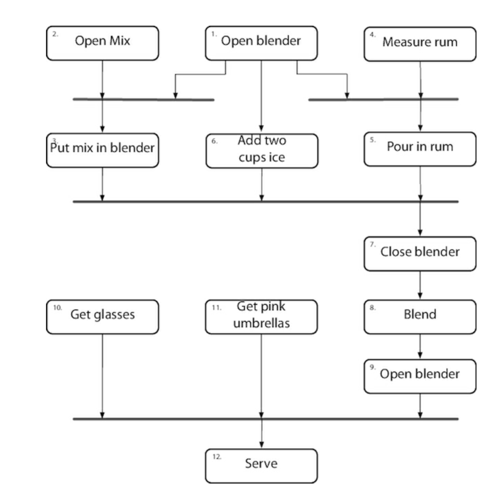
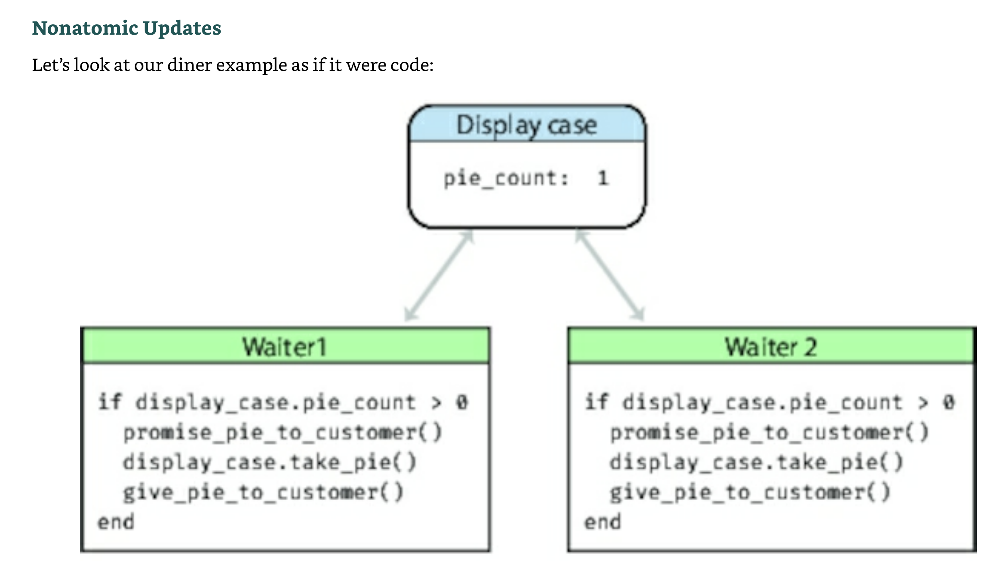
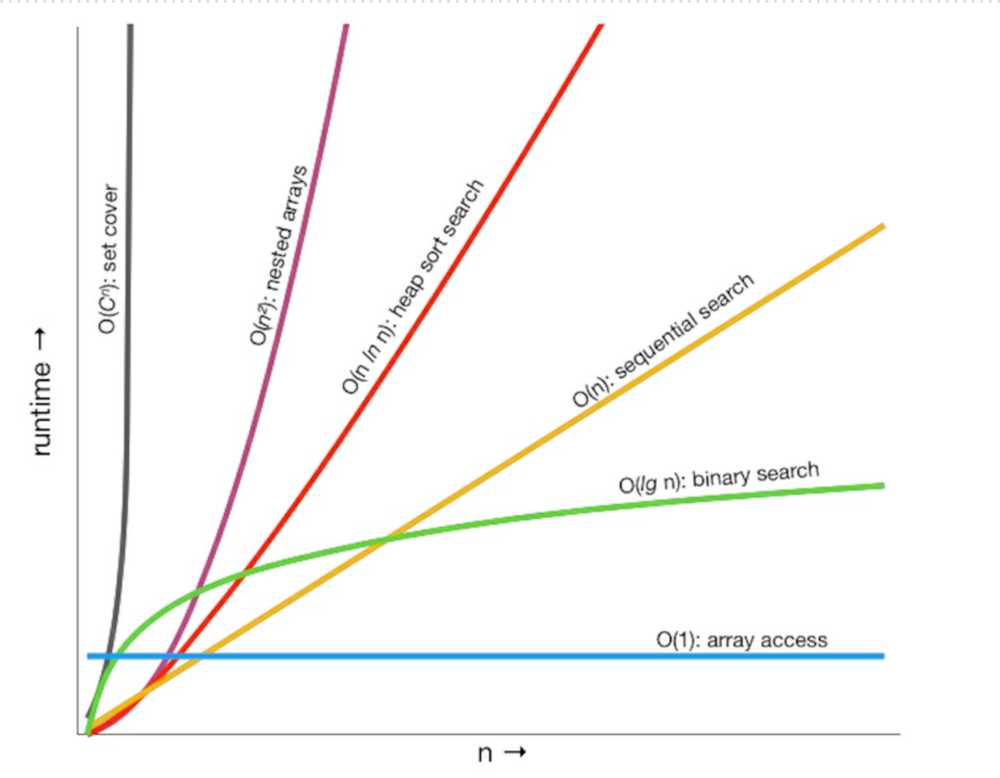

# Pragmatic programmer

## 1 A Pragmatic Philosophy

### 1 It’s Your Life

It is your life. You own it. You run it. You create it. Many developers we talk to are frustrated. Their concerns are
varied. Some feel they’re stagnating in their job, others that technology has passed them by. Folks feel they are
underappreciated, or underpaid, or that their teams are toxic. Maybe they want to move to Asia, or Europe, or work from
home.
And the answer we give is always the same.
And the answer we give is always the same.
_Why can’t you change it?_

Does your work environment suck? Is your job boring? Try to fix it. But don’t try forever. As Martin Fowler says, "you
can change your organization or change your organization."

### 2 The Cat Ate My Source Code

Team Trust - is absolutely essential for creativity and collaboration according to the research literature [e.g. (
research) [https://psycnet.apa.org/doiLanding?doi=10.1037%2Fapl0000110].
In a healthy environment based in trust, you can safely speak your mind, present your ideas, and rely on your team
members who can in turn rely on you.

Take Responsibility - When you do accept the responsibility for an outcome, you should expect to be held accountable for
it. When you make a mistake (as we all do) or an error in judgment, admit it honestly and try to offer options.
It is up to you to provide solutions, not excuses.

Before you approach anyone to tell them why something can’t be done, is late, or is broken, stop and listen to yourself.
Talk to the rubber duck on your monitor, or the cat. Does your excuse sound reasonable, or stupid? How’s it going to
sound to your boss?
Run through the conversation in your mind. What is the other person likely to say? Will they ask, "Have you tried this…"
or "Didn’t you consider that?" How will you respond? Before you go and tell them the bad news, is there anything else
you can try? Sometimes, you just know what they are going to say, so save them the trouble.

explain what can be done to salvage the situation

- refactoring
- prototyping
- better testing
- automation
- additional resources
- more time with user
- maybe time for learning some technique or technology in greater depth?

### 3 Software Entropy

**Entropy** is a term from physics that refers to the amount of "disorder" in a system.
it might be called, by the more optimistic term, "technical debt," with the implied notion that they’ll pay it back
someday. They probably won’t.

In inner cities, some buildings are beautiful and clean, while others are rotting hulks. Why? Researchers in the field
of crime and urban decay discovered a fascinating trigger mechanism, one that very quickly turns a clean, intact,
inhabited building into a smashed and abandoned derelict.[5] A broken window. One broken window, left unrepaired for any
substantial length of time, instills in the inhabitants of the building a sense of abandonment—a sense that the powers
that be don’t care about the building. So another window gets broken. People start littering. Graffiti appears. Serious
structural damage begins. In a relatively short span of time, the building becomes damaged beyond the owner’s desire to
fix it, and the sense of abandonment becomes reality. Why would that make a difference? Psychologists have done
studies[6] that show hopelessness can be contagious. Think of the flu virus in close quarters. Ignoring a clearly broken
situation reinforces the ideas that perhaps nothing can be fixed, that no one cares, all is doomed; all negative
thoughts which can spread among team members, creating a vicious spiral.

#### Tip 5 Don’t Live with Broken Windows

Don’t leave "broken windows" (bad designs, wrong decisions, or poor code) unrepaired. Fix each one as soon as it is
discovered. If there is insufficient time to fix it properly, then board it up. Perhaps you can comment out the
offending code, or display a "Not Implemented" message, or substitute dummy data instead. Take some action to prevent
further damage and to show that you’re on top of the situation. We’ve seen clean, functional systems deteriorate pretty
quickly.
You may be thinking that no one has the time to go around cleaning up all the broken glass of a project. If so, then
you’d better plan on getting a dumpster, or moving to another neighborhood. Don’t let entropy win.

### 4 Stone Soup and Boiled Frogs

Stone soup - allegory to the soldiers coming back from war stopping at village hoping for some food.
Villagers didn't want to share the food.
The soldiers boiled a pot of water and carefully placed three stones into it. The amazed villagers came out to watch.
Once villagers started to seeing what's happening one by one get more interested and ask about it, in return they hear
from soldiers.
"The stone soup is good as it is, but some say it tests better when we add X" which cause villagers to start to share
their supply with soldiers.
Eventually they had produced a large pot of steaming soup. The soldiers removed the stones, and they sat down with the
entire village to enjoy the first square meal any of them had eaten in months.

The soldiers act as a catalyst, bringing the village together, so they can jointly produce something that they couldn’t
have done by themselves—a synergistic result. Eventually everyone wins.

#### Tip 6 Be a Catalyst for Change

Work out what you can reasonably ask for. Develop it well. Once you’ve got it, show people, and let them marvel. Then
say "of course, it would be better if we added…" Pretend it’s not important. Sit back and wait for them to start asking
you to add the functionality you originally wanted. People find it easier to join an ongoing success. Show them a
glimpse of the future, and you’ll get them to rally around.

boiled frog - that if you take a frog and drop it into boiling water, it will jump straight back out again. However, if
you place the frog in a pan of cold water, then gradually heat it, the frog won’t notice the slow increase in
temperature and will stay put until cooked. The frog just doesn't notice the change.

Don’t be like the fabled frog. Keep an eye on the big picture. Constantly review what’s happening around you, not just
what you personally are doing.

### 5 Good-Enough Software

The scope and quality of the system you produce should be discussed as part of that system’s requirements.

Great software today is often preferable to the fantasy of perfect software tomorrow. If you give your users something
to play with early, their feedback will often lead you to a better eventual solution (Tracer Bullet).

### 6 Your Knowledge Portfolio

Managing a knowledge portfolio is very similar to managing a financial portfolio:

- Serious investors invest **regularly—as a habit**.
- **Diversification** is the key to long-term success.
- Smart investors balance their portfolios between **conservative** and **high-risk**, high-reward investments.
- Investors try to buy low and sell high for maximum return.
- Portfolios should be reviewed and rebalanced periodically.

Goals:

- Learn at least one new language every year
- Read a technical book each month
- Read nontechnical books, too
- Take classes
- Participate in local user groups and meetups
- Experiment with different environments
- Stay current

#### Tip 10 Critically Analyze What You Read and Hear

A favorite consulting trick: ask "why?" at least five times. Ask a question, and get an answer. Dig deeper by asking
"why?" Repeat as if you were a petulant four-year old (but a polite one). You might be able to get closer to a root
cause this way.

- Who does this benefit? It may sound cynical, but follow the money can be a very helpful path to analyze. The benefits
  to someone else or another organization may be aligned with your own, or not.
- What’s the context? Everything occurs in its own context, which is why "one size fits all" solutions often don’t.
  Consider an article or book touting a "best practice." Good questions to consider are best for "who?" What are the
  prerequisites, what are the consequences, short and long term?
- When or Where would this work? Under what circumstances? Is it too late? Too early? Don’t stop with first-order
  thinking (what will happen next), but use second-order thinking: what will happen after that?
- Why is this a problem? Is there an underlying model? How does the underlying model work?

### 7 Communicate!

Treat English (or whatever your native tongue may be) **as just another programming language**. Write natural language
as you would write code: honor the DRY principle, ETC, automation, and so on. (We discuss the DRY and ETC design
principles in the next chapter.)

**Know Your Audience** - By making the appropriate pitch to each group, you’ll get them all excited about your project.
As with all forms of communication, the trick here is to gather feedback. Don’t just wait for questions: ask for them.
Look at body language, and facial expressions. One of the Neuro Linguistic Programming presuppositions is "The meaning
of your communication is the response you get." Continuously improve your knowledge of your audience as you communicate.

**Know What You Want to Say**
Fiction writers often plot out their books in detail before they start, but people writing technical documents are often
happy to sit down at a keyboard, enter:

```
  1. Introduction 
```

Plan what you want to say. Write an outline. Then ask yourself, "Does this communicate what I want to
express to my audience in a way that works for them?" Refine it until it does.

**Choose Your Moment**
Catch a manager who’s just been given a hard time by her boss because some source code got lost, and you’ll have a more
receptive listener to your ideas on source code repositories. Make what you’re saying relevant in time, as well as in
content. Sometimes all it takes is the simple question, "Is this a good time to talk about…?"

**Make It Look Good**
Too many developers (and their managers) concentrate solely on content when producing written documents. We think this
is a mistake. Any chef (or watcher of the Food Network) will tell you that you can slave in the kitchen for hours only
to ruin your efforts with poor presentation.
There is no excuse today for producing poor-looking printed documents.

**Involve Your Audience**
If possible, involve your readers with early drafts of your document. Get their feedback, and pick their brains. You’ll
build a good working relationship, and you’ll probably produce a better document in the process.

**Be a Listener**
There’s one technique that you must use if you want people to listen to you: listen to them. Even if this is a situation
where you have all the information, even if this is a formal meeting with you standing in front of 20 suits—if you don’t
listen to them, they won’t listen to you. Encourage people to talk by asking questions, or ask them to restate the
discussion in their own words. Turn the meeting into a dialog, and you’ll make your point more effectively. Who knows,
you might even learn something.

**Get Back to People**
Always respond to emails and voicemails, even if the response is simply "I’ll get back to you later".
communicate. The more effective that communication, the more influential you become.

**Keep code and documentation together**
Writing documentation can be made easier by not duplicating effort or wasting time, and by keeping documentation close
at hand—in the code itself. In fact, we want to apply all of our pragmatic principles to documentation as well as to
code.

It’s easy to produce good-looking documentation from the comments in source code, and we recommend adding comments to
modules and exported functions to give other developers a leg up when they come to use it.
Restrict your non-API commenting to discussing why something is done, its purpose and its goal. The code already
shows how it is done, so commenting on this is redundant—and is a violation of the DRY principle.

**Online Communication tips**

Our tips are simple:

- Proofread before you hit **SEND**.
- Check your spelling and look for any accidental autocorrect mishaps.
- Keep the format simple and clear.
- Keep quoting to a minimum.
- No one likes to receive back their own 100-line email with "I agree" tacked on. If you’re quoting other people’s
  email, be sure to attribute it, and quote it inline (rather than as an attachment). Same when quoting on social media
  platforms.
- Don’t flame or act like a troll unless you want it to come back and haunt you later. If you wouldn’t say it to
  someone’s face, don’t say it online.
- Check your list of recipients before sending. It’s become a cliché to criticize the boss over departmental email
  without realizing that the boss is on the cc list. Better yet, don’t criticize the boss over email.

As countless large corporations and politicians have discovered, email and social media posts are forever. Try to give
the same attention and care to email as you would to any written memo or report.

## 2 A Pragmatic Approach

### The Essence of Good Design

#### Tip 14 Good Design Is Easier to Change Than Bad Design

ETC - easier to change - principle
every design principle out there is a special case of ETC.
Why is decoupling good? Because by isolating concerns we make each easier to change. ETC.
Why is the single responsibility principle useful? Because a change in requirements is mirrored by a change in just one
module. ETC.
Why is naming important? Because good names make code easier to read, and you have to read it to change it. ETC!

**ETC Is a Value, Not a Rule**

Deliberately ask yourself "did the thing I just did make the overall system easier or harder to change?" Do it when you
save a file. Do it when you write a test. Do it when you fix a bug.
It assumes that a person can tell which of many paths will be easier to change in the future. Much of the time, common
sense will be correct, and you can make an educated guess.
If you're still not sure which is the best solution, you can:

- Try to make the code you write replaceable
- treat this as a way to develop instincts.Note the situation in your engineering day book: the choices you have, and
  some guesses about change. Leave a tag in the source. Then, later, when this code has to change, you’ll be able to
  look back and give yourself feedback. It might help the next time you reach a similar fork in the road.

### 9 DRY - The Devils of Duplication

Most people assume that maintenance begins when an application is released, that maintenance means fixing bugs and
enhancing features. We think these people are wrong. Programmers are constantly in maintenance mode. Our understanding
changes day by day. New requirements arrive and existing requirements evolve as we’re heads-down on the project. Perhaps
the environment changes. Whatever the reason, maintenance is not a discrete activity, but a routine part of the entire
development process.

We feel that the only way to develop software reliably, and to make our developments easier to understand and maintain,
is to follow what we call the **DRY principle**:

DRY - Don't Repeat Yourself - _Every piece of knowledge must have a single, unambiguous, authoritative representation
within a system._

Don’t copy-and-paste lines of source is only a part of DRY.

DRY is about the duplication of knowledge, of intent. It’s about expressing the same thing in two different places,
possibly in two totally different ways.

Here’s the acid test: when some single facet of the code has to change, do you find yourself making that change in
multiple places, and in multiple different formats? Do you have to change code and documentation, or a database schema
and a structure that holds it, or…? If so, your code isn’t DRY.

**Not All Code Duplication Is Knowledge Duplication**

Not All Code Duplication Is Knowledge Duplication As part of your online wine ordering application you’re capturing and
validating your user’s age, along with the quantity they’re ordering. According to the site owner, they should both be
numbers, and both greater than zero. So you code up the validations:

``` python
def validate_age(value): 
  validate_type(value, :integer) 
  validate_min_integer(value, 0)

def validate_quantity(value): 
  validate_type(value, :integer) 
  validate_min_integer(value, 0)
```

The code is the same, but the knowledge they represent is different. The two functions validate two separate things that
just happen to have the same rules. That’s a coincidence, not a duplication.

#### 1. DRY Violation in Documentation

Don't repeat the intent of the function in the comment. Try to write the function and names in a way that it's self
expressing.

#### 2. DRY Violation in Data

```java
class Line {
    Point start;
    Point end;
    double length;
}
```

we have duplication. The length is defined by the start and end points: change one of the points and the length changes.
It’s better to make the length a calculated field:

```java
class Line {
    Point start;
    Point end;

    double length() {
        return star.distanceTo(end);
    }
}
```

It's OK to violate the DRY principle fo performance reasons. e.g. caching the data.
Where possible, always use accessor functions to read and write the attributes of objects. It will make it easier to add
functionality in the future.

_All services offered by a module should be available through a uniform notation, which does not betray whether they are
implemented through storage or through computation._

#### 2. DRY Violation in Representation

Your code needs to know how to communicate with libraries, API or the schemas (e.g. error codes).
The duplication here is that two things (your code and the external entity) have to have knowledge of the representation
of their interface. Change it at one end, and the other end breaks.
Some strategies:
**Duplication across internal API** - look for tools that let you specify the API in some kind of neutral format. These
tools will typically generate documentation, mock APIs, functional tests, and API clients, the latter in a number of
different languages. Ideally the tool will store all your APIs in a central repository, allowing them to be shared
across teams.

**Duplication Across External APIs** - Increasingly, you’ll find that public APIs are documented formally using
something like OpenAPI.This allows you to import the API spec into your local API tools and integrate more reliably
with the service. If you can’t find such a specification, consider creating one and publishing it. Not only will others
find it useful; you may even get help maintaining it.

**Duplication with Data Sources** - Many data sources allow you to introspect on their data schema. This can be used to
remove much of the duplication between them and your code. Rather than manually creating the code to contain this stored
data, you can generate the containers directly from the schema. Many persistence frameworks will do this heavy lifting
for you.
There’s another option, and one we often prefer. Rather than writing code that represents external data in a
fixed structure (an instance of a struct or class, for example), just stick it into a key/value data structure (your
language might call it a map, hash, dictionary, or even object). On its own this is risky: you lose a lot of the
security of knowing just what data you’re working with. So we recommend adding a second layer to this solution: a simple
table-driven validation suite that verifies that the map you’ve created contains

**Inter-developer Duplication** - at the module level, the problem is more insidious. Commonly needed functionality or
data that doesn’t fall into an obvious area of responsibility can get implemented many times over.
We feel that the best way to deal with this is to encourage active and frequent communication between developers. Maybe
run a daily scrum standup meeting. Set up forums (such as Slack channels) to discuss common problems. This provides a
non-intrusive way of communicating—even across multiple sites—while retaining a permanent history of everything said.
Appoint a team member as the project librarian, whose job is to facilitate the exchange of knowledge. Have a central
place in the source tree where utility routines and scripts can be deposited. And make a point of reading other people’s
source code and documentation, either informally or during code reviews. You’re not snooping—you’re learning from them.
And remember, the access is reciprocal—don’t get twisted about other people poring (pawing?) through your code, either.

### 10 Orthogonality

"Orthogonality" is a term borrowed from geometry. Two lines are orthogonal if they meet at right angles, such as the
axes on a graph. It's generalization of the geometric notion of perpendicularity.
In computing, the term has come to signify a kind of independence or decoupling. Two or more things are
orthogonal if changes in one do not affect any of the others.

We want to design components that are self-contained: independent, and with a single, well-defined purpose (what Yourdon
and Constantine call cohesion in Structured Design: Fundamentals of a Discipline of Computer Program and Systems
Design[YC79]). When components are isolated from one another, you know that you can change one without having to worry
about the rest. As long as you don’t change that component’s external interfaces, you can be confident that you won’t
cause problems that ripple through the entire system.

Two major benefits if you write orthogonal systems:

1. increased productivity - It is easier to write relatively small, self-contained components than a single large block
   of code. Simple components can be designed, coded, tested, and then forgotten—there is no need to keep changing
   existing code as you add new code.
1. reduced risk - Diseased sections of code are isolated. If a module is sick, it is less likely to spread the symptoms
   around the rest of the system. It is also easier to slice it out and transplant in something new and healthy.

Most developers are familiar with the need to design orthogonal systems, although they may use words such as modular,
component-based, and layered to describe the process.

Orthogonality is closely related to the DRY principle. With DRY, you’re looking to minimize duplication within a system,
whereas with orthogonality you reduce the interdependency among the system’s components. It may be a clumsy word, but if
you use the principle of orthogonality, combined closely with the DRY principle, you’ll find that the systems you
develop are more flexible, more understandable, and easier to debug, test, and maintain.

### 11 Reversibility

What you can do is make it easy to change. Hide third-party APIs behind your own abstraction layers. Break your code
into components: even if you end up deploying them on a single massive server, this approach is a lot easier than taking
a monolithic application and splitting it.

### 12 Tracer Bullets

the term tracer bullet development is used to visually illustrate the need for immediate feedback under actual
conditions with a moving goal.

Tracer bullets work because they operate in the same environment and under the same constraints as the real bullets.
They get to the target fast, so the gunner gets immediate feedback. And from a practical standpoint they’re a relatively
cheap solution.
Look for the important requirements, the ones that define the system. Look for the areas where you have doubts, and
where you see the biggest risks. Then prioritize your development so that these are the first areas you code.
Tracer code is not disposable: you write it for keeps. It contains all the error checking, structuring, documentation,
and self-checking that any piece of production code has. It simply is not fully functional. However, once you have
achieved an end-to-end connection among the components of your system, you can check how close to the target you are,
adjusting if necessary. Once you’re on target, adding functionality is easy.
Tracer development is consistent with the idea that a project is never finished: there will always be changes required
and functions to add. It is an incremental approach.

The tracer code approach has many advantages:

- Users get to see something working early - your users will know they are seeing something immature. They won’t be
  disappointed by a lack of functionality; they’ll be ecstatic to see some visible progress toward their system.
- Developers build a structure to work in - it. If you have worked out all the end-to-end interactions of your
  application, and have embodied them in code, then your team won’t need to pull as much out of thin air. This makes
  everyone more productive, and encourages consistency.
- You have an integration platform - have an integration platform As the system is connected end-to-end, you have an
  environment to which you can add new pieces of code once they have been unit-tested.
- You have something to demonstrate
- You have a better feel for progress

**Tracer Code versus Prototyping**
You might think that this tracer code concept is nothing more than prototyping under an aggressive name. There is a
difference. With a prototype, you’re aiming to explore specific aspects of the final system. With a true prototype, you
will throw away whatever you lashed together when trying out the concept, and recode it properly using the lessons
you’ve learned. The tracer code approach addresses a different problem. You need to know how the application as a whole
hangs together. You want to show your users how the interactions will work in practice, and you want to give your
developers an architectural skeleton on which to hang code.

### 13 Prototypes and Post-it Notes

What sorts of things might you choose to investigate with a prototype?

- Anything that carries risk.
- Anything that hasn’t been tried before,
- Anything that is absolutely critical to the final system.
- Anything unproven, experimental, or doubtful.
- Anything you aren’t comfortable with.

You can prototype:

- Architecture
- New functionality in an existing system
- Structure or contents of external data
- Third-party tools or components
- Performance issues
- User interface design

Prototyping is a learning experience. Its value lies not in the code produced, but in the lessons learned. That’s really
the point of prototyping.

**How to Use Prototypes**
When building a prototype, what details can you ignore?

**Correctness**
You may be able to use dummy data where appropriate.

**Completeness**
The prototype may function only in a very limited sense, perhaps with only one preselected piece of input data and one
menu item.

**Robustness**
Error checking is likely to be incomplete or missing entirely. If you stray from the predefined path, the prototype may
crash and burn in a glorious display of pyrotechnics. That’s okay.

**Style**
Prototype code shouldn’t have much in the way of comments or documentation (although you may produce reams of
documentation as a result of your experience with the prototype).

### 14 Domain Languages

We always try to write code using the vocabulary of the application domain (see Maintain a Glossary). In some cases,
Pragmatic Programmers can go to the next level and actually program using the vocabulary, syntax, and semantics—the
language—of the domain.
E.g. Cucumber is programming-language neutral way of specifying tests. You run the tests using a version of Cucumber
appropriate to the language you’re using. In order to support the natural-language like syntax, you also have to write
specific matchers that recognize phrases and extract parameters for the tests.

### 15 Estimating

| Duration  	  |      Quote estimate in          	      |
|:------------:|:--------------------------------------:|
| 1-15 days  	 |         Days                 	         |
| 3-6 weeks  	 | Weeks                                	 |
| 8-20 weeks 	 | Months                               	 |
| 20+ weeks  	 | Think hard before giving an estimate 	 |

**Where Do Estimates Come From?**
Ask someone who’s already done it. Before you get too committed to model building, cast around for someone
who’s been in a similar situation in the past. See how their problem got solved.

**Understand What’s Being Asked**
You need to have a grasp of the scope of the domain. Often this is implicit in the question, but you need to make it a
habit to think about the scope before starting to guess. Often, the scope you choose will form part of the answer you
give: "Assuming there are no traffic accidents and there’s gas in the car, I should be there in 20 minutes."

**Build a Model of the System**
From your understanding of the question being asked, build a rough-and-ready bare-bones mental model.
Building the model introduces inaccuracies into the estimating process. This is inevitable, and also beneficial. You are
trading off model simplicity for accuracy. Doubling the effort on the model may give you only a slight increase in
accuracy. Your experience will tell you when to stop refining.

**Break the Model into Components**
Once you have a model, you can decompose it into components. You’ll need to discover the mathematical rules that
describe how these components interact. Sometimes a component contributes a single value that is added into the result.
You’ll find that each component will typically have parameters that affect how it contributes to the overall model. At
this stage, simply identify each parameter.

**Give Each Parameter a Value**
Once you have the parameters broken out, you can go through and assign each one a value. You expect to introduce some
errors in this step. The trick is to work out which parameters have the most impact on the result, and concentrate on
getting them about right. Typically, parameters whose values are added into a result are less significant than those
that are multiplied or divided.

**Calculate the Answers**
A spreadsheet can be a big help. Then couch your answer in terms of these parameters.
During the calculation phase, you get answers that seem strange. Don’t be too quick to dismiss them. If your arithmetic
is correct, your understanding of the problem or your model is probably wrong. This is valuable information.

**Keep Track of Your Estimating Prowess**
We think it’s a great idea to record your estimates, so you can see how close you were. If an overall estimate involved
calculating sub-estimates, keep track of these as well. Often you’ll find your estimates are pretty good—in fact, after
a
while, you’ll come to expect this.

#### Estimating Project Schedules -Painting the Missile

"How long will it take to paint the house?" "Well, if everything goes right, and this paint has the coverage they claim,
it might be as few as 10 hours. But that’s unlikely: I’d guess a more realistic figure is closer to 18 hours. And, of
course, if the weather turns bad, that could push it out to 30 or more."

That’s how people estimate in the real world. Not with a single number (unless you force them to give you one) but with
a range of scenarios.

#### What to Say When Asked for an Estimate

You say “I’ll get back to you.” You almost always get better results if you slow the process down and spend some time
going through the steps we describe in this section. Estimates given at the coffee machine will (like the coffee) come
back to haunt you.

## 6 Concurrency

definition:<br>
_Concurrency_ is when the execution of two or more pieces of code **act** as if they run at the same time.<br>
_Parallelism_ is when they **do** run at the same time.

concurrency is a software mechanism, and parallelism is a hardware concern. If we have multiple processors, either
locally or remotely, then if we can split work out among them, we can reduce the overall time things take.

### 33 Breaking Temporal Coupling

temporal coupling - coupling in time. Method A must always be called before method B, only one report can be run at a
time, you must wait for the screen to redraw before the button click is received. Tick must happen before tock.
This is not very flexible and not very realistic.

Allowing concurrency and think about decoupling of any time or order dependencies.
Result: systems that are easier to reason about, that potentially respond faster and more reliably.

#### Looking for concurrency

In many projects we'd like to find out what **can** happen at the same time and what **must** in a strict order.
One way to do is by _activity diagram_.

activity diagram - set of actions (drawn as rounded boxes). The arrow leads an action leads to either:

- another action (which can start after the first action completes)
- thick line called a _synchronization bar_ <br>

once all actions leading into a synchronization bar are complete you can then proceed along any arrows leaving the bar,
An action with no arrows leading into it can be started at any time.
Activity diagram is used to maximize parallelism by identifying activities that could be performed in parallel but
aren't.

For instance, we may be writing the software for a robotic piña colada maker.<br>
We’re told that the steps are:

1. Open blender
1. Open piña colada mix
1. Put mix in blender
1. Measure 1/2 cup white rum
1. Pour in rum
1. Add 2 cups of ice
1. Close blender
1. Liquefy for 1 minute
1. Open blender
1. Get glasses
1. Get pink umbrellas
1. Serve



the top-level tasks (1, 2, 4, 10, and 11) can all happen concurrently, up front. Tasks 3, 5, and 6 can happen in
parallel later.
When we look at the activities, we realize that number 8, liquefy, will take a minute. During that time, our bartender
can get the glasses and umbrellas (activities 10 and 11) and probably still have time to serve another customer.

### 34. Shared State is Incorrect State

Customer is in restaurant asks server if there is a pie left, he looks, sees in the display that there is one left piece
and
confirms. Customer orders the pie.
Same thing happens on the other side of the restaurant at exact time.
One of the customers will be disappointed.



Both waiters operate concurrently (in real life in parallel).
The problem above is shared state. Both waiters when executes _display_case.pie_count()_ they copy the value from the
display into their own memory. If the value in the display case changes their memory (which is used to make decision) is
now out of date.
Solution? make the operation atomic.

Semaphore is a _thing_ that only one person can own at a time. (lock/unlock claim/release)
In above example it can be used to decide who can access pie case.

```
case_semaphore.lock() 
 if display_case.pie_count > 0
    promise_pie_to_customer()
    display_case.take_pie()
    give_pie_to_customer()
 end
case_semaphore.unlock() 
```

This approach above works and solve mentioned issue, but there is another problem.
This approach as long as every developer will use the semaphore, it that's not the case we are in the same place as
before.

**Make the Resource Transactional**
We can centralize that control by checking and getting pie in one call:

```
def get_pie_if_available()
    @case_semaphore.lock() 
    try {
        if @slices.size > 0
            update_sales_data(:pie) 
            return @slices.shift
        else
            false
        end
        }
    ensue {
         @case_semaphore.unlock()
    }
    end
```

**Random Failures Are Often Concurrency Issues**

### 35 Actors and Processes

- An _actor_ is an independent virtual processor with its own local (and private) state. Each actor has a mailbox. When
  a
  message appears in the mailbox and the actor is idle, it kicks into life and processes the message. When it finishes
  processing, it processes another message in the mailbox, or, if the mailbox is empty, it goes back to sleep.

When processing a message, an actor can create other actors, send messages to other actors that it knows about, and
create a new state that will become the current state when the next message is processed.

- A _process_ is typically a more general-purpose virtual processor, often implemented by the operating system to
  facilitate concurrency. Processes can be constrained (by convention) to behave like actors, and that’s the type of
  process we mean here.

**Actors Can Only Be Concurrent**<br>
There are a few things that you won’t find in the definition of actors:

- There’s no single thing that’s in control. Nothing schedules what happens next, or orchestrates the transfer of
  information from the raw
  data to the final output.
- The only state in the system is held in messages and in the local state of each actor. Messages cannot be examined
  except by being read by their recipient, and local state is inaccessible outside the actor.
- All messages are one way—there’s no concept of replying. If you want an actor to return a response, you include your
  own mailbox address in the message you send it, and it will (eventually) send the response as just another message
  to that mailbox.
- An actor processes each message to completion, and only processes one message at a time.

As a result, actors
execute concurrently, asynchronously, and share nothing. If you had enough physical processors, you could run an actor
on each. If you have a single processor, then some runtime can handle the switching of context between them. Either way,
the code running in the actors is the same.

#### Tip 59 Use Actors for concurrency without Shared State

### Topic 36 Blackboards

Blackboard is a common (shared?) space where multiple independent actors/processes/agents can access the stored data in
a form of _laissez-faire_ concurrency,

## 7 While You Are Coding

### 37 Listen to Your Lizard Brain

#### Tip 61 Listen to Your Inner Lizard

1. First, stop what you’re doing.
2. Give yourself a little time and space to let your brain organize itself.
3. Stop thinking about the code,
4. do something that is fairly mindless for a while, away from a keyboard. Take a walk, have lunch,
   chat with someone. Maybe sleep on it. Let the ideas percolate up through the layers of your brain on their own: you
   can’t force it.
5. wait for a "ha!" moment.

If that doesn't work, try to explain the code to someone (even to rubber duck).

If still you have a problem, it's time for prototyping.

### 38 Programming by Coincidence

Why should you take the risk of messing with something that’s working? <br>
Well, we can think of several reasons:

- It may not really be working—it might just look like it is.
- The boundary condition you rely on may be just an accident.
  In different circumstances (a different screen resolution, more CPU cores), it might behave differently.
- Undocumented behavior may change with the next release of the library. Additional and unnecessary calls make your code
  slower. Additional calls increase the risk of introducing new bugs of their own. For code, you write that others will
  call, the basic principles of good modularization and of hiding implementation behind small, well-documented
  interfaces can all help.

tip: never store a phone number in numeric field

### 39 Algorithm Speed

#### Big-O Notation - mathematical way of dealing with approximations.

highest-order term will dominate the value as increases, the convention is to remove all low-order terms, and not to
bother showing any constant multiplying:

O(n^2/2 + 3n) == O(n^2) == O(n^2)

```
O(1) - Constant (access element in array, simple statements)
O(lg n) - Logarithmic (binary search). The base of the logarithm doesn’t matter, so this is equivalent.
O(n) - Linear (sequential search)
O(n lg n) - Worse than linear, but not much worse. (Average runtime of quicksort, heapsort)
O(n^2) - Square law (selection and insertion sorts)
O(n^3) - Cubic (multiplication of two  matrices)
O(C^n) - Exponential (traveling salesman problem, set partitioning)
```



### 40 Refactoring

Software development is like gardening -You plant many things in a garden according to an initial plan and conditions.
Some thrive, others are destined to end up as compost. You may move plantings relative to each other to take advantage
of the interplay of light and shadow, wind and rain. Overgrown plants get split or pruned, and colors that clash may get
moved to more aesthetically pleasing locations. You pull weeds, and you fertilize plantings that are in need of some
extra help. You constantly monitor the health of the garden, and make adjustments (to the soil, the plants, the layout)
as needed.

Refactoring [Fow19] is defined by Martin Fowler as a: disciplined technique for restructuring an existing body of code,
altering its internal structure without changing its external behavior.

_Time pressure is often used as an excuse for not refactoring. But this excuse just doesn’t hold up: fail to refactor
now, and there’ll be a far greater time investment to fix the problem down the road—when there are more dependencies to
reckon with. Will there be more time available then? Nope._

When explaining think of the code that needs refactoring as "a growth." Removing it requires invasive surgery. You can
go in now, and take it out while it is still small. Or, you could wait while it grows and spreads—but removing it then
will be both more expensive and more dangerous. Wait even longer, and you may lose the patient entirely.

Martin Fowler offers the following simple tips on how to refactor without doing more harm than good:

1. Don’t try to refactor and add functionality at the same time.
2. Make sure you have good tests before you begin refactoring. Run the tests as often as possible. That way you will
   know quickly if your changes have broken anything.
3. Take short, deliberate steps:
    - move a field from one class to another,
    - split a method,
    - rename a variable.

Refactoring often involves making many localized changes that result in a larger-scale change. If you keep your
steps small, and test after each step, you will avoid prolonged debugging.

### 41 Test to Code

_We believe that the major benefits of testing happen when you think about and write the tests, not when you run them._

Why? Because it allows you to understand the under the hood requirements of feature (e.g. parameters)

Use TDD, but avoid:

- They spend inordinate amounts of time ensuring that they always have 100% test coverage.
- They have lots of redundant tests. For example, before writing a class for the first time, many TDD adherents will
  first write a failing test that simply references the class’s name. It fails, then they write an empty class
  definition, and it passes. But now you have
  a test that does absolutely nothing; the next test you write will also reference the class, and so it makes the first
  unnecessary. There’s more stuff to change if the class name changes later. And this is just a trivial example.
- Their designs tend to start at the bottom and work their way up. (TIP 68, Build End-to-End, Not Top-Down or Bottom Up)

Build small pieces of end-to-end functionality, learning about the problem as you go. Apply this learning as you
continue to flesh out the code, involve the customer at each step, and have them guide the process.

The basic cycle of TDD is: Decide on a small piece of functionality you want to add. Write a test that will pass once
that functionality is implemented. Run all tests. Verify that the only failure is the one you just wrote. Write the
smallest amount of code needed to get the test to pass, and verify that the tests now run cleanly. Refactor your code:
see if there is a way to improve on what you just wrote (the test or the function). Make sure the tests still pass when
you’re done. The idea is that this cycle should be very short: a matter of minutes, so that you’re constantly writing
tests and then getting them to work.

### 42 Property-Based Testing

invariants, things that remain true about some piece of state when it’s passed through a function. For example, if you
sort a list, the result will have the same number of elements as the original—the length is invariant.

#### Tip Use property based tests to validate your assumptions

There are also code invariants, things that remain true about some piece of state when it’s passed through a function.
For example, if you sort a list, the result will have the same number of elements as the original—the length is
invariant. Once we work out our contracts and invariants (which we’re going to lump together and call properties) we can
use them to automate our testing. What we end up doing is called property-based testing.

```python
from hypothesis import given
import hypothesis.strategies as some 

@given(some.lists(some.integers()))
def test_list_size_is_invariant_across_sorting(a_list):
    original_length = len(a_list)
    a_list.sort() 
    assert len(a_list) == original_length 
    
@given(some.lists(some.text()))
def test_sorted_result_is_ordered(a_list):
    a_list.sort()
    for i  in range(len(a_list) - 1): 
        assert a_list[i] <= a_list[i + 1]

Thomas, David; Hunt, Andrew. Pragmatic Programmer, The (pp. 394-395). Pearson Education. Kindle Edition. 
```

### 43 Stay Safe Out There

#### Security Basic Principles

Pragmatic Programmers have a healthy amount of paranoia. We know we have faults and
limitations, and that external attackers will seize on any opening we leave to compromise our systems. Your particular
development and deployment environments will have their own security-centric needs, but there are a handful of basic
principles that you should always bear in mind:

1. Minimize Attack Surface Area
2. Principle of The Least Privilege
3. Secure Defaults
4. Encrypt Sensitive Data
5. Maintain Security Updates

### 44 Naming Things

whenever you create something, you need to pause and think "what is my motivation to create this?"

It’s important that everyone on the team knows what project jargon means, and that they use them consistently.

1. encourage a lof of communication e.g. Pair programming, huddles
2. Keep project glossary, listing the terms that have special meaning ot the team (e.g. on confluence)

## 8 Before The Project

### 45 The Requirements Pit

### Tip 76 Programmers Help People Understand What They Want

we annoy people by looking for edge cases and asking about them.

_- You: We were wondering about the $50 total. Does that include what we’d normally charge for shipping?

- Client: Of course. It’s the total they’d pay us.
- You: That’s nice and simple for our customers to understand: I can see the attraction. But I can see some less
  scrupulous customers trying to game that system.
- Client: How so? You: Well, let’s say they buy a book for $25, and then select overnight shipping, the most expensive
  option. That’ll likely be about $30, making the
  whole order $55. We’d then make the shipping free, and they’d get overnight shipping on a $25 book for just $25._

**At this point the experienced developer stops. Deliver facts, and let the client make the decisions**

If it's not easy to get a feedback create a mockup and prototype to show to the client "is this way you meant?" this
gives you quick feedback loop.

**walk in your cline's shoes**
simple way to achieve this is by becoming a client - spend time on the clients daily work routine to understand better
the context.

### 46 Solving Impossible Puzzles

#### Tup 81 Don’t Think Outside the Box—Find the Box

Whenever you're solving a hard problem focus on constrains

You must challenge any preconceived notions and evaluate whether or not they are real, hard-and-fast constraints. It’s
not whether you think inside the box or outside the box. The problem lies in finding the box—identifying the real
constraints.

ask questions:

- Why are you solving this problem?
- What’s the benefit of solving it?
- Are the problems you’re having related to edge cases? Can you eliminate them?
- Is there a simpler, related problem you can solve?

When you have a problem with solving the problem always take a break and focus on something different.

### 47 Working Together

**Pair Programming** - one developer operates the keyboard, and the other does not. Both work on the problem together,
and can switch typing duties as needed.

**Mob Programming** - extension of pair programing but using more than 2 people (not necessarily ony developers).
you swap out the typist every 5-10 minutes.

#### Tip 82 Don’t Go into the Code Alone

### 48 The Essence of Agility

Manifesto values:

- **Individuals and interactions** over processes and tools
- **Working software** over comprehensive documentation
- **Customer collaboration** over contract negotiation
- **Responding to change** over following a plan

That is, while there is value in the items on the right, we value the items on the left more.

Agile is not about process but responding to change, to the unknowns after you set out.

The above values don't tell what to do. They tell you what to look for.

our recipe for working in an agile way:

1. Work out where you are.
1. Make the smallest meaningful step towards where you want to be.
1. Evaluate where you end up, and fix anything you broke.
1. Repeat

## 9 Pragmatic Projects

### 49 Pragmatic teams

team has to support the **no broken window** (those small imperfections that no one fixes) mentality.
Also be stayed alerted to avoid being **Boiled Frogs**. It’s even easier for teams as a whole to get boiled. People
assume that someone else is handling an issue, or that the team leader must have OK’d a change that your user is
requesting. Even the best-intentioned teams can be oblivious to significant changes in their projects.

**Communicate Team Presence** - team needs to communicate with the rest of the organization.
To outsiders, the worst project teams are those that appear sullen and reticent. They hold meetings with no structure,
where no one wants to talk. Their emails and project documents are a mess: no two look the same, and each uses different
terminology.

There is a simple marketing trick that helps teams communicate as one: generate a brand. When you start a project, come
up with a name for it, ideally something off-the-wall. (In the past, we’ve named projects after things such as killer
parrots that prey on sheep, optical illusions, gerbils, cartoon characters, and mythical cities.) Spend 30 minutes
coming up with a zany logo, and use it. Use your team’s name liberally when talking with people. It sounds silly, but it
gives your team an identity to build on, and the world something memorable to associate with your work.

Organize Fully Functional Teams - That means that you need all the skills to do that within the team: frontend, UI/UX,
server, DBA, QA, etc.
It allows to build end-to-end functionality in small pieces.

### 50 Coconut don't cut it

The goal of course isn’t to "do Scrum," "do agile," "do Lean," or what-have-you. The goal is to be in a position to
deliver working software that gives the users some new capability at a moment’s notice. Not weeks, months, or years from
now, but now. For many teams and organizations, continuous delivery feels like a lofty, unattainable goal, especially if
you’re saddled with a process that restricts delivery to months, or even weeks. But as with any goal, the key is to keep
aiming in the right direction.

### 51 Pragmatic Starter Kit

covering three critical and interrelated topics:

- Version Control - is needed
- Regression Testing - Use all kinds of testing to make sure that your code is working properly.
  (Unit test, Integration tests, QA testing, performance testing) + make sure to test the state not the coverage
- Full Automation - if something can be automated do it (like setting up your environment, CI)

### 52 Delight Your Users

Understand the underlying expectations of value behind the project, you can start thinking about how you can deliver
against them:

- Make sure everyone on the team is totally clear about these expectations.
- When making decisions, think about which path forward moves closer to those expectations.
- Critically analyze the user requirements in light of the expectations. On many projects we’ve discovered that the
  stated "requirement" was in fact just a guess at what could be
  done by technology: it was actually an amateur implementation plan dressed up as a requirements document. Don’t be
  afraid to make suggestions that change the requirement if you can demonstrate that they will move the project closer
  to
  the objective.
- Continue to think about these expectations as you progress through the project.

### 53 Pride and Prejudice

You shouldn’t jealously defend your code against interlopers; by the same token, you should treat other people’s code
with respect. The Golden Rule ("Do unto others as you would have them do unto you") and a foundation of mutual respect
among the developers is critical to make this tip work.
We want to see pride of ownership. "I wrote this, and I stand behind my work." Your signature should come to be
recognized as an indicator of quality. People should see your name on a piece of code and expect it to be solid, well
written, tested, and documented. A really professional job. Written by a professional.

## 10 Postface

Many non-embedded systems can also do both great good and great harm. Social media can promote peaceful revolution or
foment ugly hate. Big data can make shopping easier, and it can destroy any vestige of privacy you might think you have.
Banking systems make loan decisions that change people’s lives. And just about any system can be used to snoop on its
users. We’ve seen hints of the possibilities of a utopian future, and examples of unintended consequences leading to
nightmare dystopia. The difference between the two outcomes might be more subtle than you think. And it’s all in your
hands.

We have a duty to ask ourselves two questions about every piece of code we deliver:

1. Have I protected the user?
2. Would I use this myself?

