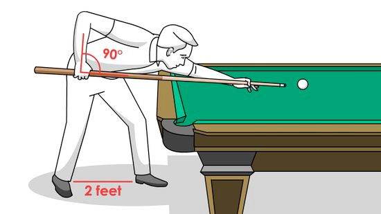
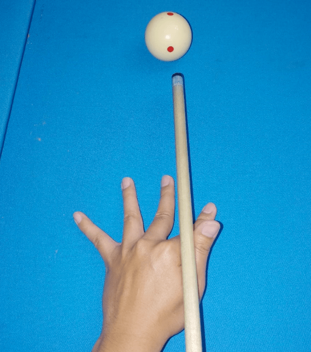
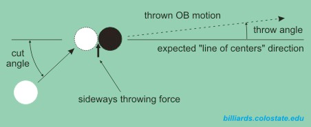

# Pool

## improving your game

**proper posture**

everything needs to be inline, keep the proper distance from the cue ball (enough space for aiming and continuation with cue)

**bridge hand**

(we should adjust the bridge height based on where we plan to hit the cue ball)

**grip** should be relaxed

** always look at the ghost ball when hitting the cue ball**

**throw effect** when aiming with cut angle you need to adjust for the thrown angle cause by spin 

**always follow through with cue**

**do not rush with decision**

** everytime you change decision (or adjust) stand up**

stay still after the shot

** how to break**

1. make sure that rack is tight
1. use cushion to form bridge
1. aim bellow the middle the cue ball as the force will likely move the cue higher

** positional play **

think about which areas for the cue ball will allow you to continue according to your plan.
1  solution how to approach the order is to reverse the trace. 
"which position is the easiest to put the black ball?"
then find the ball that will allows you to be in that spot after the ball will be putted. 
repeat for all balls.
