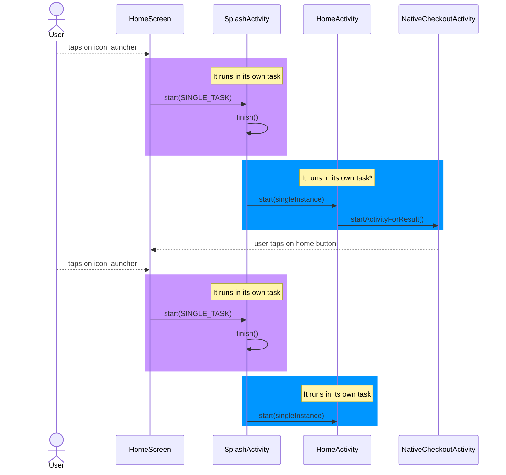
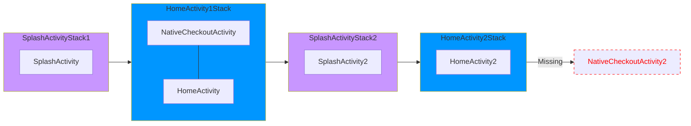

# AndroidManifest.xml

## \<activity>

### taskAffinity

```
android:taskAffinity="string"
```

The affinity determines two things — the task that the activity is **re-parented** to (see the `allowTaskReparenting`
attribute) and the task that will **house** the activity when it is launched with the FLAG_ACTIVITY_NEW_TASK flag.

By default, the taskAffinity is based on `Applicaiton` `namespace` (when is not set it's taken from package).

**taskAffinity takes precedence over [launchMode](#launchmode).**

### launchMode

[StackOverflow link explaining it](https://stackoverflow.com/a/14991341/5864033)

```
android:launchMode="standard|singleTop|singleTask|singleInstance|singleInstancePerTask"
```

`standard` - Default. The system always creates a new instance of the activity in the target task
and routes the intent to it.

`singleTop` - If an instance of the activity already exists at the top of the target task, the system routes the intent
to that instance through a call to its onNewIntent() method, rather than creating a new instance of the activity.
**ONLY ONE ACTIVITY AT THE TOP OF THE STACK OF PARTICULAR TASK**

`singleTask` - The system creates the activity at the root of a new task or locates the activity on an existing task
with the same **affinity**. If an instance of the activity already exists **and** is at the root of the task, the system
routes
the intent to existing instance through a call to its onNewIntent() method, rather than creating a new instance.
Meanwhile, all the other activities on top of it are **destroyed**.
**FIND EXISTING ACTIVITY WITH SAME AFFINITY IN THE TASK OR CREATE NEW TASK**

`singleInstance` - **The activity is always the single and only member of its task.**, beside Same as "singleTask",
holding the instance. - not recommended for general
use, This can be useful for activities that require a unique, persistent state, such as a login screen or a settings
page.

`singleInstancePerTask` - the first activity that
created the task, and therefore there will only be one instance of this activity in a task; but activity can be
instantiated multiple times in different tasks.

**task** - stack of activities

**Start a task**
You can set up an activity as the entry point for a task by giving it an intent filter with "android.intent.action.MAIN"
as the specified action and "android.intent.category.LAUNCHER" as the specified category. For example:

```
<activity ... >
    <intent-filter ... >
        <action android:name="android.intent.action.MAIN" />
        <category android:name="android.intent.category.LAUNCHER" />
    </intent-filter>
    ...
</activity>
```

if activity is launched with launchMode: singleTask, singleInstance, singleInstancePerTask it's important to note that
the activity will **only** clear the stack of its own task.
e.g. 
- ActivityA, `launchMode:singleTask`
- ActivityB, `launchMode:singleInstance`
- ActivityC, `launchMode:standard`

each activity is started without additional flags as `startActivity()`
note: if Activity is started as `startActivityForResult()` it belongs to the **same task** which started the activity.

flow: `A->B->C`
tasks [backstack]:
1. [A] 
2. [B] 
3. [C]

Each Activity will be in separate task, because ActivityB is forcing to be started as new task and as single element. 
Lyst Issue:
The Stack of activities is cleared whenever we click on launcher. The problem is not affecting only
`NativeCheckoutAcitivty`, but any activity that is opened from HomeActivity

1. `SplashActivity` is always started as `launchMode:SingleTask` -> tapping on Launcher Icon will always clear the stack of
   activities above it, although in our case it’s not really an issue because it’s the only activity in this stack
   anyway because `SplashActivitiy` always calls `finish()` when navigating somewhere + `HomeActivity` settings cause it would
   happen anyway if `finish()` wouldn’t be called.
2. `HomeActivity` is always started as `launchMode:SingleInstance` -> tapping on Launcher Icon will always clear the stack
   of activities above `HomeActivity`, it is our case.
   Because it is started as `SingleInstance` whenever we put app in the background and comeback new `SplashActivity` is
   created which is opening `HomeActivity`, because the task for `HomeActivity` already exists, `HomeActivity` is reopened with
   clearing of the stack above.
   With current approach it’s impossible to keep any other activity on TOP of `HomeActivity` when pressing launcher icon.





Possible Solutions for fixing the issue require changes in architecture:
Changing the launchModes:
In our case the SplashActivity flag is not so important, it could be even SingleInstance and it would produce similar
result (as we are always finishing this activity).
To improve performance from Android12 probably it would be good to remove SpashActivity
HomeActivity can’t keep launchMode:SingleInstance, as long as we will have it the stack above will be cleared.
In reality, the task for NativeCheckout activity could potentially exist separately with some way of knowing that we
need to navigate to it after coming back to app, but this solution looks too complicated - KISS.
This solution is one recommended in Googles’ documentation.

Making sure that HomeActivity is always at the top of the stack - which would mean that we shouldn’t have any navigation
from HomeActivity that is an Activity (in practice, it means that each Activity should be replaced with Fragment).
This might be easier to implement, but it would also require logic to show/hide the bottom navigation bar.

In both cases, it requires at least medium effort to complete/fix the issue as not only we need to do the changes, but
we need to make sure that we didn’t break anything. We would also need to do thorough testing of the whole app as
regression is probable.

On top of it:

* The `HomeActivity` is started as `singleInstance` which should in theory make sure that it will be the only member of
  its task.
  Though because `AccountActivity` and `NativeCheckoutActivity`  is started as `startActivityForResult()` it belongs to
  the same task
  as `HomeActivity`
