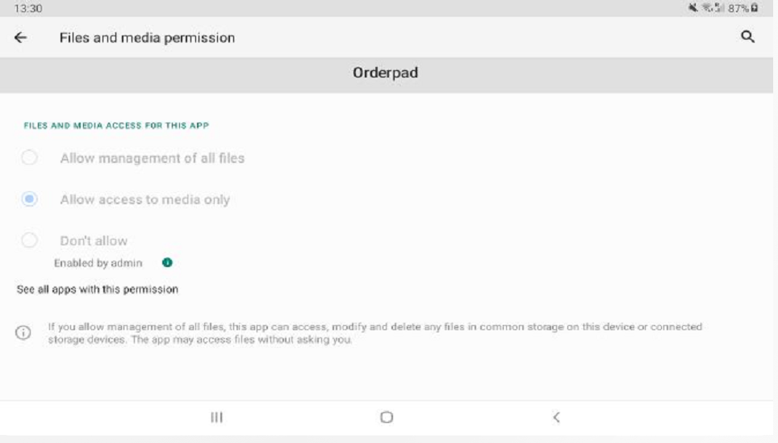
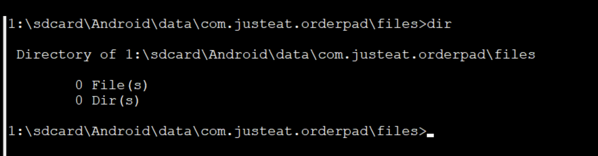
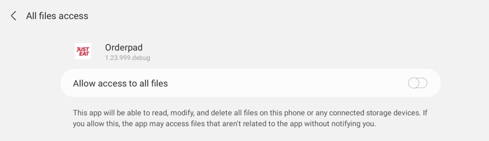

# Soti MobiControl

## Android 11 access external storage solutions

With Android 11 apps can't access easily external storage (sd card).
This change was introduce to increase protection of the user.  
Problem - all files that are used by JET e.g. `deviceInfo.ini` (this one is used to get IMEI), `OrderPad.log.0` are
stored on sd card.
Which means devices that are running on Android 11 and above can't access those files by default.

### 1. Force the permission via SOTI mobicontrol:

note: All cases described below where completed with permission added to the `AndroidManifest.xml`:  
`<uses-permission android:name="android.permission.MANAGE_EXTERNAL_STORAGE" />`

**1.1.**

Josh from The SOTI team gave as below instruction how can we achieve it: 
`afw_set_permission_grant_state com.justeat.orderpad android.permission.MANAGE_EXTERNAL_STORAGE allow`

unfortunately it didn't resolve the problem as permission wasn't granted: 

**1.2.**

Second solution from Josh was to try the below one: 
`request_appops_permission android.permission.MANAGE_EXTERNAL_STORAGE allow com.justeat.orderpad`

Same result, it didn't work.

**1.3.**

below works locally via terminal:  
`adb shell appops set com.justeat.orderpad MANAGE_EXTERNAL_STORAGE allow`

so I tried to adjust the package from 1.2 and also tried:  
`request_appops_permission MANAGE_EXTERNAL_STORAGE allow com.justeat.orderpad`
though it didn't work either.

#### summary

Explanation from Josh why it's not working:

_In order for MobiControl to have the ability to grant other apps any kind of special permissions, we need access to
API’s which Samsung do not offer. For other manufacturers we often work around this with the MobiControl agent plugin,
but for Samsung this doesn’t exist. I was hoping that one of the two scripts may have still worked but given the
information I’ve found since Nic’s first email, these would never have worked on a Samsung device running Android 11._

_Having further researched, it seems other customers have made the same request and have been unable to come to a
workable solution._

_It seems the only way which might be possible to get Orderpad to have the permission, is to embed the permission
request into the app installation._

to check:

- I asked Josh for clarification what he mean by _embed the permission request into the app installation_

### 2. Using app specific external storage

This approach rather than trying to get the required permission is taking advantage of the available solution that was
introduced in Android 11.
Each application has access to its own storage (path) inside sd card if required. This doesn't require any permission to
be acquired from the user.
This solution does work in terms of creating logs on sd card under the directory:
`/sdcard/Android/data/com.justeat.orderpad/files/OrderPad.log.0` which is accessible by app.

The downside is that files in this directory aren't accessible by SOTI MobiControl.

Which means:

- we can't download the logs file via SOTI MobiControl (TO CONFIRM WITH JOSH)

To check:

- can we put files there via SOTI (when app is added to distribution) instead of putting them in the root of SD card? -
  Nic asked question to Josh
- is there a different way for us to get the logs instead of via SOTI? like pushing it to some server/tool

### 3. Getting permission from the user

We can request a permission from the user in runtime, though because it's not standard permission but [special
permission](https://developer.android.com/guide/topics/permissions/overview#special) thus it can't grant directly in the
app, but rather through system settings, as described in [documentation] (https://developer.android.com/training/permissions/requesting-special)  
Once requested the permission (we can define when it's going to happen), we are going to show below screen:

Once user grands permission we have access to external storage.

to check:

- is there a way for us to show and switch the toggle via SOTI MobiControl?

### 4. Shared Media Storage