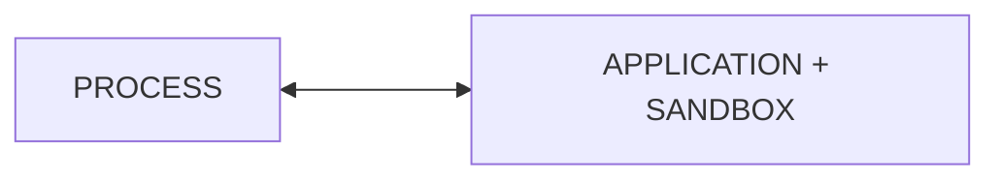
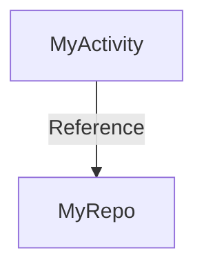

## Threading

In android each program (application) gets its own task.
This task is associated with isolated execution environment (sandbox).



Each process can host one or more tasks. In Android these are Threads.
Threads _share_ the execution environment with the parent process. They can communicate and exchange data.

**thread** - single in process task

creation:

1. extend thread class
2. creating runnable and passing to constructor of `Thread(myRunnable)`

advantage of 2nd approach is using "composition over inheritance"

Android UI thread lives as long as app

Memory assignment

```kotlin
class MyActivity : Activity {
    lateinit var myRepo: Repo
    override fun onCreate() {
        myRepo = Repo()
    }
}
```

Memory model of the above code



[Roots](../java.md#Memory-Leaks) in Android App:

1. object referenced from static fields
2. Instances of application class (it's almost always the case)
3. Live threads

Tip: Each anonymous (which is inner class) have implicit reference to enclosing class objects.
So creating anonymous thread in onCreate of Activity then starting thread and closing Activity will cause memory leak as
long as thread is running,
because thread has reference to Activity.
Each thread is Root for GC, hence GC can't clear the memory of Activity - memory leak.

Thread termination:

1. Allow to complete successfully by return in run()
2. Return from run() in response to an error
3. return from run() in response to external flag
4. return from run() in response to interruption

`Handler` - simply wraps same thread which loops "forever" as long as it's not stopped.
`Lopper.getMainLooper()` - abstraction over UI thread which loops over runnable

The safe way is to not create `Handler`s and lookers and only use:
`Handler(Looper.getMainLooper())` as this is the only way to get UI thread

Difference between `Looper.getMainLopper().post()` and `runOnUiThread()`:

- `post()` is adding a block to execute to a queue which means the block will be executed in future
- `runOnUiThread()` - if current thread is Main it will immediately execute code,
  otherwise it will fall back to `post()`