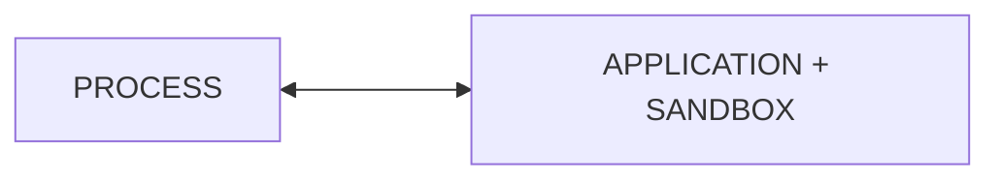
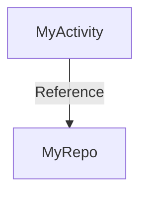
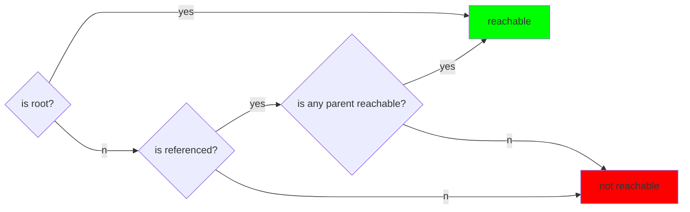

## Threading

In android each program (application) gets its own task.
This task is associated with isolated execution environment (sandbox).



Each process can host one or more tasks. In Android these are Threads.
Threads _share_ the execution environment with the parent process. They can communicate and exchange data.


**thread** - single in process task

creation:
1. extend thread class
2. creating runnable and passing to constructor of `Thread(myRunnable)`

advantage of 2nd approach is using "composition over inheritance"

Android UI thread lives as long as app

Memory assignment

```kotlin
class MyActivity: Activity {
    lateinit var myRepo: Repo
    override fun onCreate() {
        myRepo = Repo()
    }
}
```

Memory model of the above code


**Garbage Collector, GC** - system process which automatically reclaims memory 
by discarding objects that are no longer in use (not reachable) 

Object reachability flow:



### Multithreading

decomposition of app logic into multiple concurrent tasks


