# Threading

### Loci 12A bedroom

1. open doors - [Thread](#Thread)
1. taking of shirt - [Looper & Queue](#Looper-&-queue)
1. taking of trousers - [CPU operations basics Single-Tasking System](#CPU-Operations-basics)
1. lift the duvet up -  [Preemptive multitasking system](#Preemptive multitasking system)
1. snakes on bedsheet - [Multiprocessing system](#Multiprocessing system)
1. bedsheet is clean - [Visibility problem](#Visibility problem)
1. laying head on pillow - [Atomicity problem](#Atomicity problem)
1. Domi 'give it to me'! - [Atomic value](#Atomic)
1. DragonBall fusion - [Synchronized](#Synchronized)
1. picking up the fibres - [Happens-Before](#Happens Before)
1. throwing to bin - [Happens-Garbage Collector](#Garbage Collector)
1. oil leaking from celling [Memory Leak](#Memory Leak)

I am going sleep, and I am standing in open bedroom doors I spot the yarn laying on the floor that which fibre goes
string to bed.
Next I take of my t-shirt and the letters fall out from under the shirt, small creature starts collecting them, the
letters are floating around the creature in circles.
In the same moment, the letters one by one are flying out by the window.
New machines fly in, and I'm telling it in binary to help me take of my trousers.
The machine is analyzing the code and starts taking of the trousers in steps.
After each step machine screams the count of instructions completed.
I am starting to lifting the duvet and I notice that I have 4 hands that are lifting the duvet.
Movements of all hands is very robotic - each hand is moving in short sequences with lagging.
Only one hand is moving at a specie time, this hand is changing color to glowing green based on at which hand I am
looking at. After lifting the duvet I can see the fabrics from the yarn on the bedsheet.
They are in red color, and it's start forming and moving like snakes parallel into different directions.
Suddenly 2nd me tells me that he doesn't see the snakes, while I can still see the snakes.
He explains to me that it's become of the transparent screen between me and the bed, I move to a side to change the
angle
and I can see the screen with dollars floating on the screen which were not visible before, no sneaks either.
I lay down on the pillow which suddenly becomes visible atoms flying above my head.
I'm catching the atoms with my hands but when I'm opening hands I can see only one atom.
Domi enters the bedroom and screams "give it to me"!, I am saying that I can't give it right now.
and I will give it her once I will finish playing with atom.
Then we are both doing like in dragonball fusion screaming "synchronized!" and I'm passing an atom to Domi.
Domi is holding an atom, and she doesn't see snakes, problem solved!
I stared to picking up the fibres from yarn and I remind myself that this happened before.

## Thread

single in process task

creation in Android:

1. extend thread class
2. creating runnable and passing to constructor of `Thread(myRunnable)`

advantage of 2nd approach is using "composition over inheritance"

Android UI thread lives as long as app

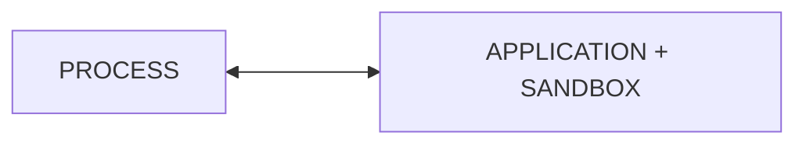

Each process can host one or more tasks. In Android these are Threads.
Threads _share_ the execution environment with the parent process. They can communicate and exchange data.

for each Android component (`Activity`, `Service`, `BroadcastReceiver`, `Loader`) you can specify android process
in `AndroidManifest.xml`

you can share process with different app when using same Linux User ID and same certificate.

`Handler` - simply wraps same thread which loops "forever" as long as it's not stopped.
`Lopper.getMainLooper()` - abstraction over UI thread which loops over runnable

The safe way is to not create `Handler`s and lookers and only use:
`Handler(Looper.getMainLooper())` as this is the only way to get UI thread

`View.post(Runnable)` & `Activity.runOnUiThread(runnable)` - can be used to execute code on UI thread

Difference between `Looper.getMainLopper().post()` and `runOnUiThread()`:

- `post()` is adding a block to execute to a queue which means the block will be executed in future
- `runOnUiThread()` - if current thread is Main it will immediately execute code,
  otherwise it will fall back to `post()`

### Looper & queue

Threads are using message queue as "inbox" for messages.
Threads are using Looper to manage message queue.

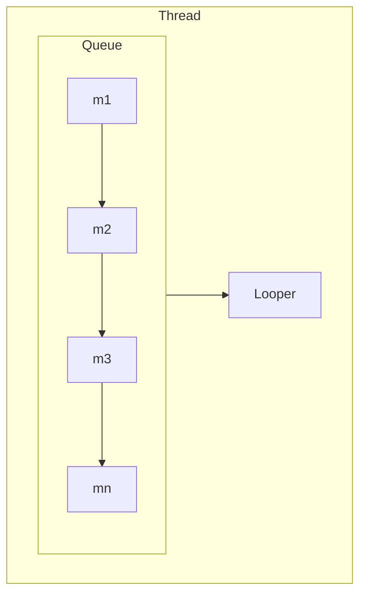

Handler.Thread has a build in Looper.
Handler itself is a "postman" that delivers messages (each message is attached to handler).
Message has to be posted and consumed inside the looper.

### CPU Operations basics

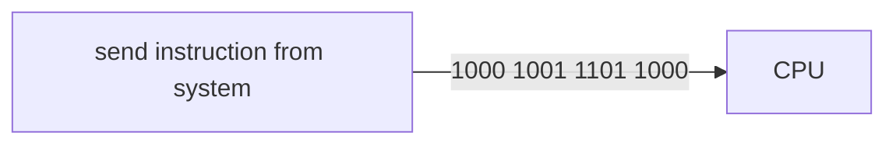

"Move the content of register (CPU internal storage) BX into register AX"

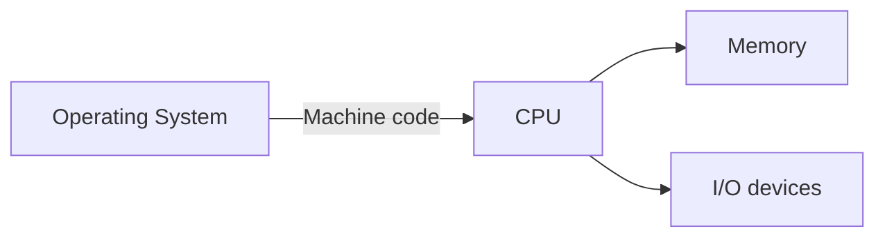

**System** = CPU + Operating System

#### Single-Tasking system

execute the machine code of one single task until the task terminates.
It's not used in most popular systems.

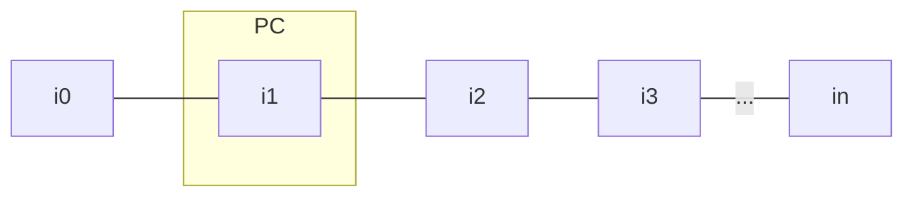

- i0 - instruction
- PC, program counter - moves from one instruction to another

#### Preemptive multitasking system

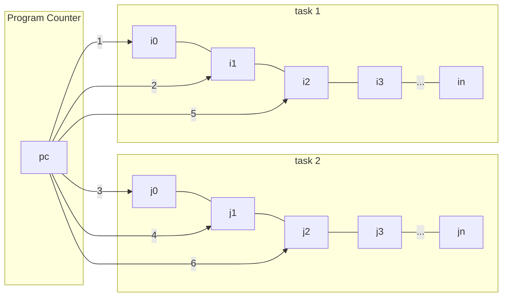

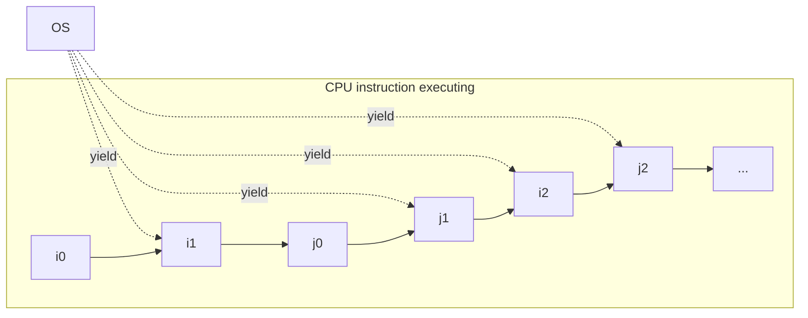

**yielding** - releasing the CPU by the Operating System. It allows other task to start using the CPU

Pros:

- allows concurrent tasks
- guarantees system responsiveness
  cons:
- very complex system in the terms of creation. Used by majority of general purpose Operating Systems e.g. Android

#### Cooperative multitasking system

Similar to preemptive multitasking system, but it's the that itself that is responsible for yielding.

Pros:

- allows concurrent execution of multiple tasks as yieldingly can happen thousands of ime on one second.
  Cons:
- one misbehaving task can claim resources for long time thus making the entire system unresponsive

### Multiprocessing system

System with more than one CPU

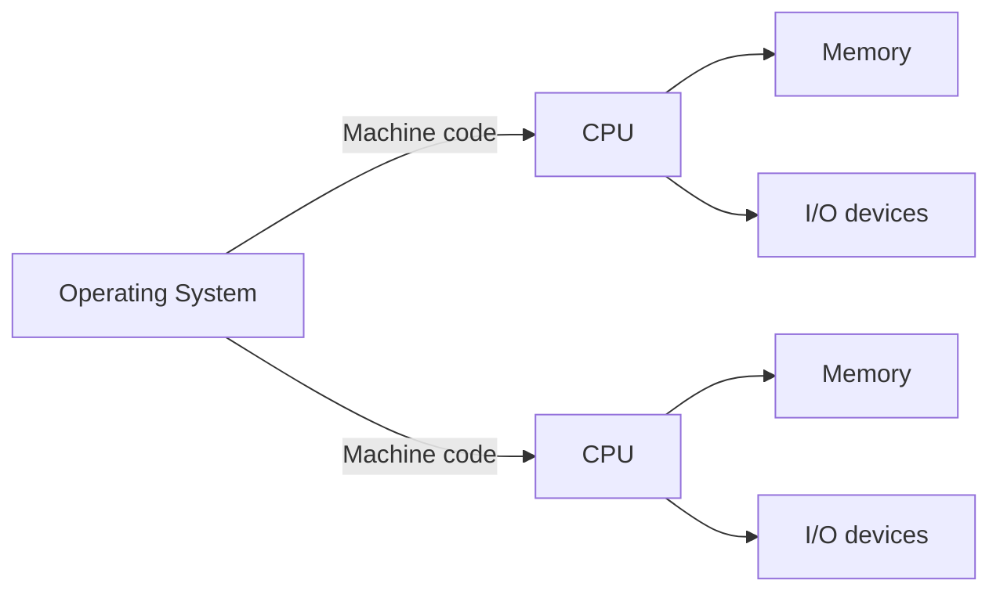

Pros:
Allows for parallelism

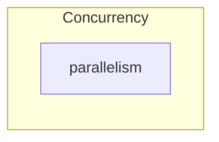

## Multithreading

decomposition of app logic into multiple concurrent tasks

concurrency - tasks <u>appear</u> to run at the same time

parallelism - tasks to run at the same time e.g. by using different core in CPU

### Visibility problem

Having 2 threads, system can decide that particular thread don't need to access filed from memory,
rather it can use value from cache. System does it for performance improvements.
This can lead to situation where another thread is updating the value of the filed
but first thread is not reading updating value but reads value from cache.

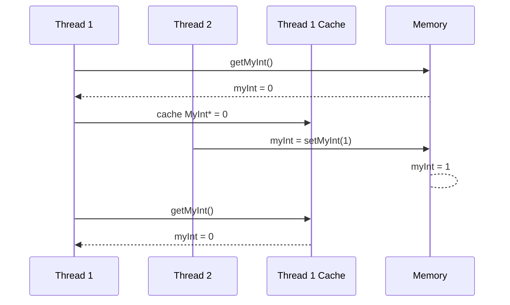

`volatile` (kotlin `@Volatile`) && `final` keywords in java makes sure that thread will read and write value from/to
memory.
(Though it doesn't solve the atomicity problem mentioned below)

```kotlin
@Volatile
var counter: int = 0
```

### Atomicity problem

Multiple threads read the same value from memory e.g. `myInt = 3`,
and increment it because each thread had the same value at the beginning the new value is 4
instead of 3 + n, (where n is the number of threads).

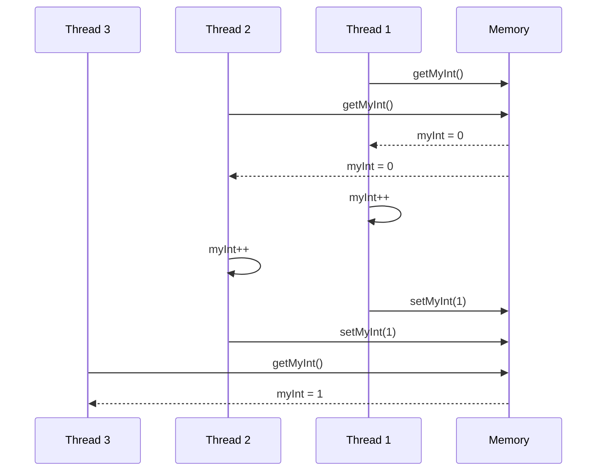

When thread is doing "read, modify, write" non-other thread can access the same instance
otherwise we have race condition.
In case of "race condition" you are not guarantee the order in which particular statements will be run.

#### Atomic

`atomic` values = guarantees that only one thread can "read, modify, write" at the given time,
all others threads have to wait.
It does not guarantee that thread will not cache the value (but the thread should never read the value from cache).

#### Synchronized

`synchronized` (kotlin `@Synchronized`) - allows to handle "race condition".

```kotlin
@Synchronized
fun incrementCounter() {
    counter++
}

```

When 2 threads are calling method which has `synchronized` keyword,
you are guaranteed that once the thread no. 1 finishes execution on synchronised
only then thread no. 2 will be able to execute the code.
note: it does not guarantee who will be next holder of monitor (it can be same thread)

Metaphor - taking stick only the one that is currently holding the stick is able to talk,
all the others have to wait. This is exactly the `Lock` "monitor" object.
Only one thread at a time can hold it: `synchronized` (Lock)<br>

Pros:

- Guarantees atomicity and visibility

cons:

- it's very complex, and it's easy to make a mistake
- performance as it blocks other threads, though it's not always significant
  (depends on the environment not really important on Android)

### Happens Before

2 actions can have happens-before relationships if:

1. First action is ordered before second action.
1. First action happens before second
1. First action is visible to second action
   It is lower level concept than "visibility".
   Visibility is a **function** **of** established (or not) **happens-before** relationships between actions.

Why we need happens-before?
Even though we write our code ordered.
In reality there is no guarantee of sequence when we have multithreading.
Compilers, JVM or CPU can reorder sequence, unless we define the constraints e.g. happens-before.

Rules:

1. if only 1 thread then order in code will be respected
2. if action `x` synchronizes* with action `y`
3. Everything before `thread.start()` is visible for thread.

*
    - includes: `synchronized` keyword, read and write `volatile`s, `java.util.concurrent`

If we have `volatile` filed (which guarantees that thread will read value from memory)
and later call to `thread.start()` we have happens-before relation.
Therefore, thread will always be checking for the value of the variable in the memory. As field was create before the
thread.

### Garbage Collector

GC - System process which automatically reclaims memory by discarding objects
that are no longer in use (not reachable)

Object reachability flow:

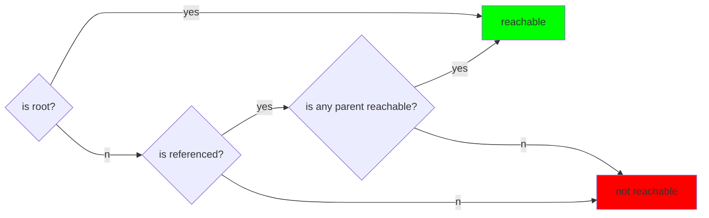

**Circular Reference**

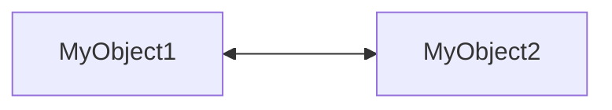

Garbage Collector is able to recognize circular reference and knows that both object are not reachable,
hence it will release memory for myObject1 and myObjet2

Each application can ask the system about how much memory is available for it by calling: getMemoryClass()
Foreground application are less likely to be killed by system

If application is Least-Recently-Used (so it's not in foreground, but in recently used) and system is running out of
memory then it's starts killing from bot-to-top but also checks which takes the most memory and might kill it

### Memory Leak

object that is no longer used but can't be Garbage Collected

**Roots** - object which are always consider by GC as reachable thus never cleaned by GC
In android each program (application) gets its own task.
This task is associated with isolated execution environment (sandbox).

Memory assignment

```kotlin
class MyActivity : Activity {
    lateinit var myRepo: Repo
    override fun onCreate() {
        myRepo = Repo()
    }
}
```

Memory model of the above code

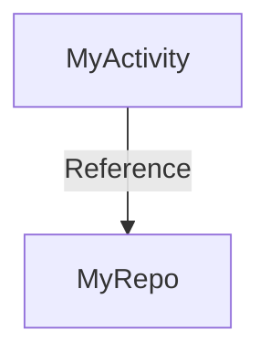

Roots in Android App:

1. object referenced from static fields
2. Instances of application class (it's almost always the case)
3. Live threads

Tip: Each anonymous (which is inner class) have implicit reference to enclosing class objects.
So creating anonymous thread in onCreate of Activity then starting thread and closing Activity will cause memory leak as
long as thread is running,
because thread has reference to Activity.
Each thread is Root for GC, hence GC can't clear the memory of Activity - memory leak.

Thread termination in Android:

1. Allow to complete successfully by return in run()
2. Return from run() in response to an error
3. return from run() in response to external flag
4. return from run() in response to interruption

``` java
lateinit var leakingObject: LeakingObject 

override fun onCreateView(inflater: LayoutInflater, container: ViewGroup?, savedInstanceState: Bundle?): View? {
    leakingObject = LeakingObject(view)
}
```

It's leaking because every time on new assignment to LeakingObject,
the old one will be held in memory without assignment as Long as it's attached to the root