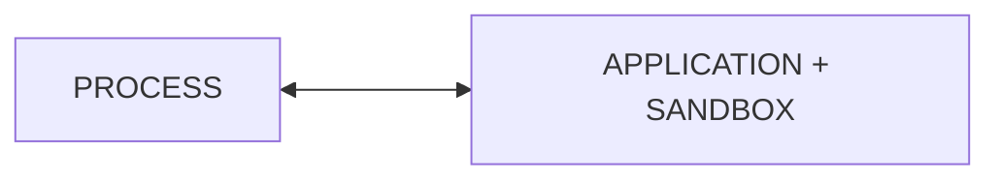

## Threading

In android each program (application) gets its own task.
This task is associated with isolated execution environment (sandbox).

Each process can host one or more tasks. In Android these are Threads.
Threads _share_ the execution environment with the parent process. They can communicate and exchange data.

**thread** - single in process task

creation:
1. extend thread class
2. creating runnable and passing to constructor of `Thread(myRunnable)`

advantage of 2nd approach is using "composition over inheritance"

Android UI thread lives as long as app

### Multithreading

decomposition of app logic into multiple concurrent tasks

