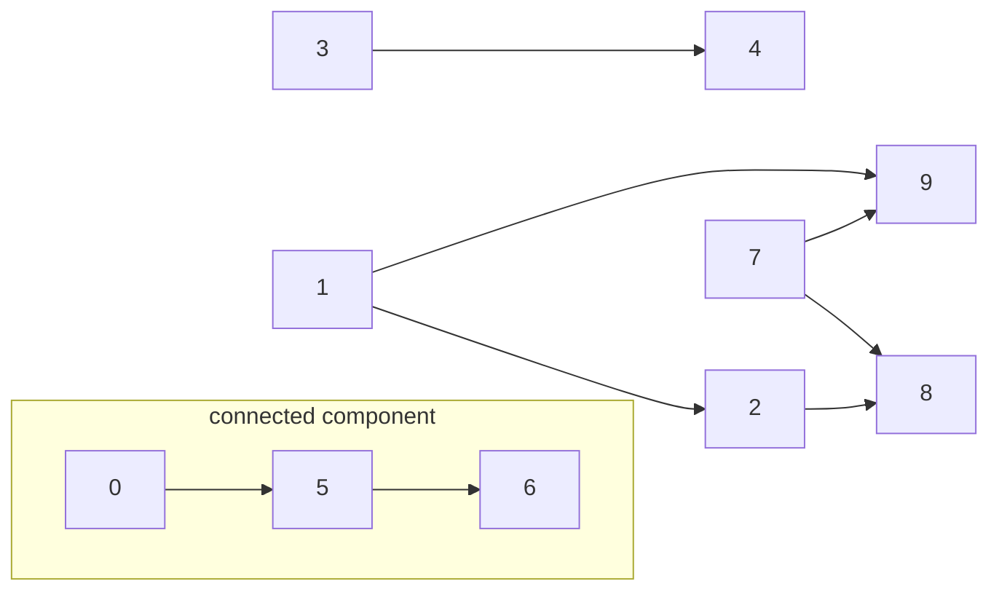
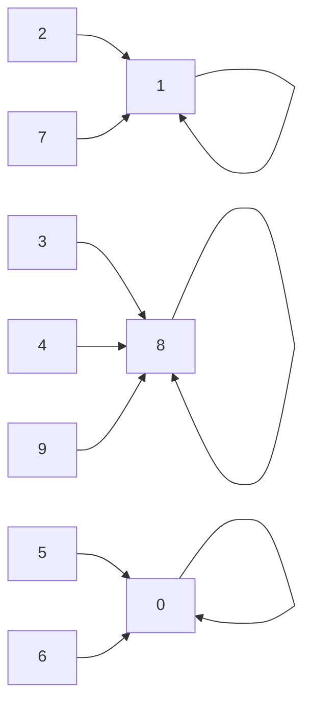
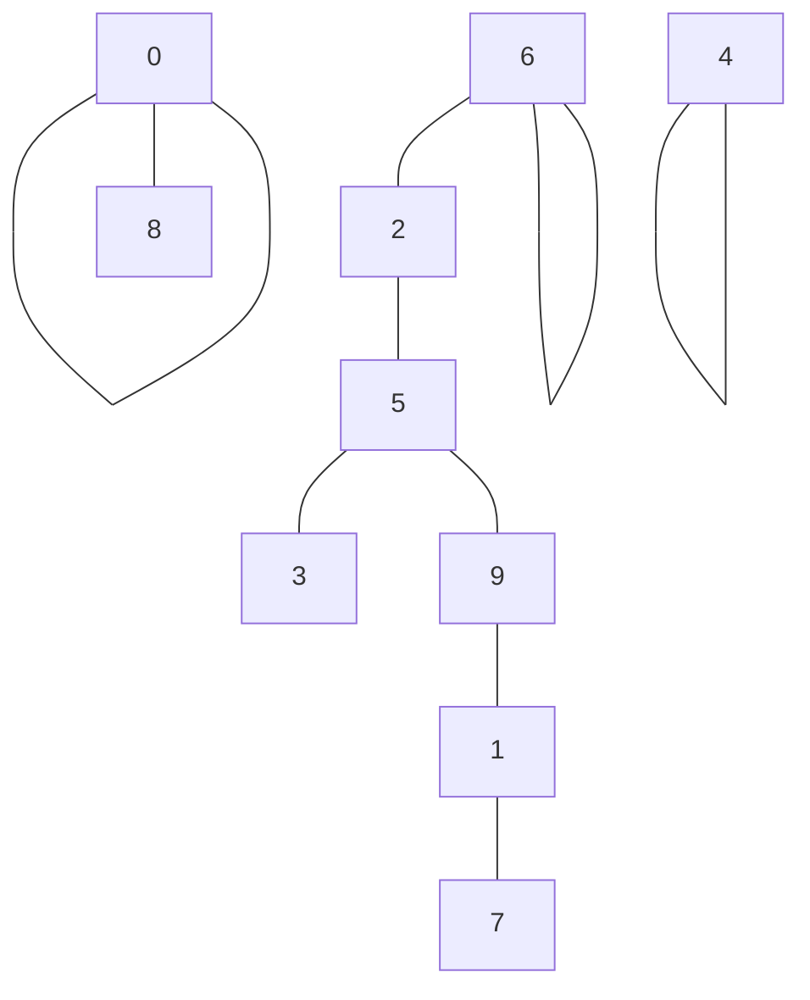
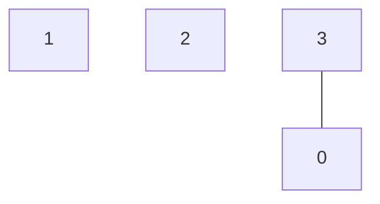
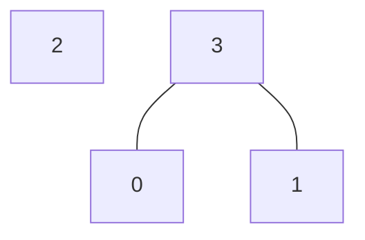
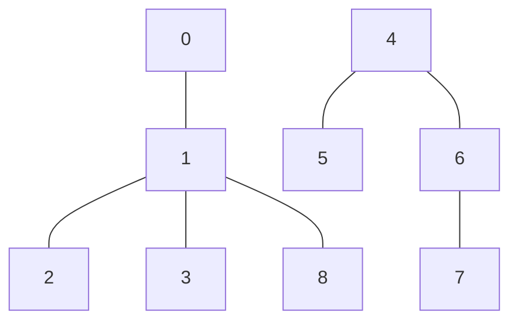
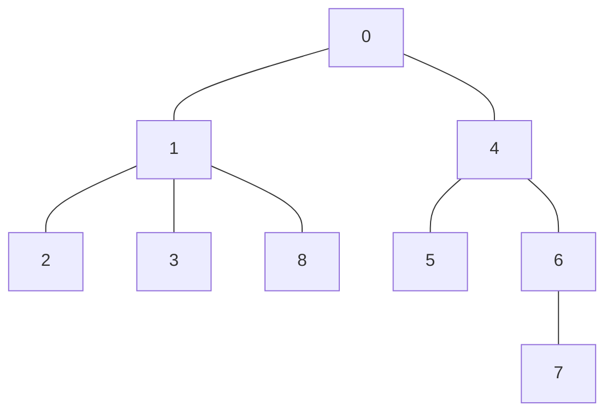
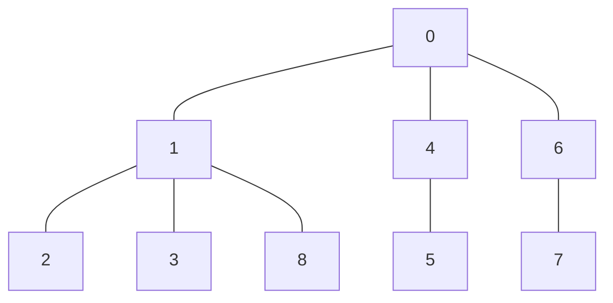
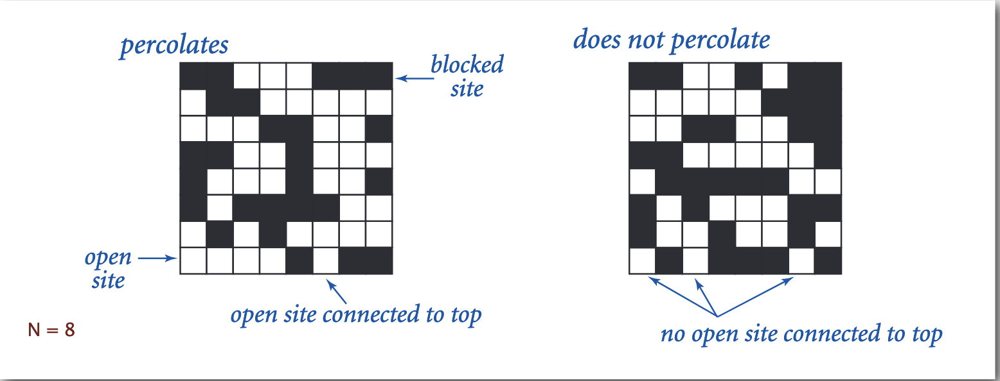

# Princeton university algorithms part 1

## 1.5 Union Find

**Dynamic connectivity**

Given a set of N objects:

- Union command: connect two objects (commonly known as p and q)
- Find/connected query: is there a patch connecting the two objects?

e.g. is there a connectivity between 0 and 6?

```
union(1, 2)
union(3, 4)
union(5, 6)
connected(0,6) - NO
union(7, 8)
union(7, 9)
union(2, 8)
union(0, 5)
connected(0,6) - YES
union(1, 9)
```



Connected components - maximal set of object that are mutually connected

it the above examples we have 3 components: `{ 0 }` `{ 1 4 5 }` `{ 2 3 6 7 }`

### Implementations

#### Quick Find (eager algorithm)

Data structure.
・Integer array id[] of length N.
・Interpretation: p and q are connected iff they have the same id

given an array:
[0,1,1,8,8,0,0,1,8,8] - known as id[]

we connect pairs by using:

- index as `p`
- value as `q`

in the above example it gives as below connected components



To merge components containing `p` and `q` change **all** entire whose id equals id[p to id[q]]
In above case, if we are doing a union of `6` and `1` then all **values** for component {0, 5, 6 } needs to change id to
used in the second component - which is 1.
array after change
[**1**,1,1,8,8,**1**,**1**,1,8,8] - known as id[]

The change is always based on order of the IDs - we change the first one to the **second** one

Union is too expensive. It takes N 2 array accesses to process a sequence of N union commands on N objects.

Quick-find defect.
・Union too expensive (N array accesses).
・Trees are flat, but too expensive to keep them fla

### Quick-union - lazy approach

- Integer array id[] of size N
- interpretation: id[i] is parent of i (so we have set of trees)
- Root of i is id[id[...id[id[i]...]]]

id[] = [0,9,6,5,4,2,6,1,0,5]

id[i] --- i



`6` is a root of the tree containing {2,5,3,9,1,7}

Find - check if p and q have the same root.
Union - to merge components containing p and q set the id of p's root to the id of the q's root.
We need to change only 1 value (root of 'p') in the array to Union components together.
So the new component is **always** pointing to the root even if the union was: child --- child or child --- root

Quick-union defect.
・Trees can get tall.
・Find too expensive (could be N array accesses)

### Improvement 1: weighting

Weighted quick-union.
・Modify quick-union to avoid tall trees.
・Keep track of size of each tree (number of objects).
・Balance by linking root of smaller tree to root of larger tree.

having an array n = 4 with bellow operations

union(0,3)



and next operation is:
union(1, 0)
instead of attaching {3, 0} to {1} we attach {1} to {3,0} as those are the rules in weighting (attach smaller tree root
to larger tree root)



Proposition. Depth of any node x is at most lg N.
Pf. When does depth of x increase?
Increases by 1 when tree T 1 containing x is merged into another tree T 2.
・The size of the tree containing x at least doubles since | T 2 | ≥ | T 1 |.
・Size of tree containing x can double at most lg N times. Why?
If you start with 1 and double log N times, you get N and there's only N nodes in the tree.
So, that's a sketch of a proof that the depth of any node x is at most log base two of N.

### improvement 2: path compression

Quick union with path compression. Just after computing the root of p, set the id of each examined node to point to that
root.

example:

having:



when union(0, 6)
THEN 1st step is adding as in weighted



after path compression



Bottom line. Weighted quick union (with path compression) makes it
possible to solve problems that could not otherwise be addressed.

・WQUPC (Weighted quick union (with path compression))reduces time from 30 years to 6 seconds.
・Supercomputer won't help much; good algorithm enables solution.

### Union-Find applications

#### Percolation

a model for many physical systems:

- N-by-N grid of sites
- Each site is open with probability p (or blocked with probability 1-p)
- System _percolates_ iff (if and only f) top and bottom are connected by open sites



How to check whether an N-by-N system percolates?
・Create an object for each site and name them 0 to N 2 – 1.
・Sites are in same component if connected by open sites.
・Percolates iff any site on bottom row is connected to site on top row.

When opening one new site in the percolation simulation, how many times is union() called?
It is called for each neighboring site that is already open. There are 4 possible neighbors, but some of them may not
already be open.

### Analysing algorithms

Running time (performance) of algorithm
reasons:

- **avoid performance bugs**
-
    - predict performance
- compare algorithms
- provide guarantees
- understand theoretical basis

_Use scientific method to understand performance_

- **Observe** some feature of the natural world
- **Hypothesize** a model that is consistent with the observations
- **Predict** events using the hypothesis
- **Verify** the predictions by making further observations
- **Validate** by repeating until the hypothesis and observations agree

Principles:

- Experiments must be **reproducible**
- Hypotheses must be **falsifiable**

Question:
Suppose that n equals 1 million.<br>
Approximately how much faster is an algorithm that performs n lg n operations
versus one that performs n^2 operations?<br>
Recall that lg is the base-2 logarithm function.

```
n^2 / nlgn  // /n

n / lgn //

10^6 / lg 10^6

2^x = 10^6
x~20

10^6 / 20 = 50 000
```

Approximately 50 000x faster

### 3-SUM

Given N distinct integers, how many triples sum to exactly zero?

Log-log plot - allows you to receive straight line which help you to understand what is the slope of the line.

Power low - each point on the straight line is equal to `aN^b`

lg(T(N)) = b Lg N + c // to power?
T(N) = fa N^b (where a = 2^c)

system independent effects:

- algorithm
- Input data

system dependent effects:

- Hardware
- Software
- System

### Type of analyses

- best case
- worst case
- average case

Theory of algorithms
establish difficulty of a problem
develop optimal approach
e.g.
1-SUM "Is there a 0 in the array?"

Upper Bound - A specific algorithm
Ex. Brute-force algorithm for 1-sum: look at every array entry
Running time of the optimal algorithm for 1-Sum is O(N)
Lower bound - Proof that no algorithm can do better
Ex. have to examine all N entries (any unexamined one might be 0)
Running time of optimal algorithm for 1-sum is M(N)

Recall that big-Oh notation provides only an upper bound on the growth rate of a function as nn gets large. In this
course, we primarily use tilde notation because it more accurately describes the function—it provides both an upper and
lower bound on the function as well as the coefficient of the leading term.

## stacks

stack - LIFO principle
queue - FIFO principle

stack often is implemented either:

1. with usage of linked list by creating a class called Node.

```java
class LinkedStackOfStrings {

    private Node first = null;

    private class Node {
        String item;
        Node next;
    }

    public boolean isEmpty() {
        return first == null;
    }

    public void push(String name) {
        Node oldFirst = first;
        first = new Node();
        first.item = name;
        first.next = oldFirst;
    }

    public String pop() {
        String item = first.item;
        first = oldFirst.next;
        return item;
    }
}

```

2. with usage of Array - with fixed capacity

```java
public class FixedCapacityStackOfStrings {

    private String[] s;
    private int N = 0;

    /*a cheat because often it's required that client doesn't know the capacity, how to solve? resizing */
    public FixedCapacityStackOfStrings(int capacity) {
        s = new String[capacity];
    }

    public boolean isEmpty() {
        return N == 0;
    }

    public void push(String name) {
        s[N++] = name;
    }

    public String pop() {
        String name = S[--N];
        s[N] == null; // remove reference to allow GC for recollection of memory
        return name;
    }
}

```

3. with usage of resizing Array

```java
public class FixedCapacityStackOfStrings {

  private String[] s = new String[10];
  private int N = 0;

  /*a cheat because often it's required that client doesn't know the capacity, how to solve? resizing */
  public FixedCapacityStackOfStrings() {
  }

  public boolean isEmpty() {
    return N == 0;
  }

  public void push(String name) {
    if (s.length == N) {
      resize(2 * s.length);
    }
    s[N++] = name;
  }

  public String pop() {
    String name = S[--N];
    s[N] == null; // remove reference to allow GC for recollection of memory
    return name;
  }

  /** @noinspection RedundantSuppression*/
  private void resize(int size) {
    String[] copy = new String[size];
    //noinspection ManualArrayCopy
    for (int i = 0; i < s.length; i++) {
      copy[i] = s[i];
    }
    s = copy;
  }
}

```

## queue

```java
class LinkedQueueOfStrings {

    private Node first = null;
    private Node last = null;

    private class Node {
        String item;
        Node next;
    }

    public boolean isEmpty() {
        return first == null;
    }

    public void enqueue(String name) {
        Node oldLast = last;
        last = new Node();
        last.item = name;
        last.next = null;
        if (first == null) first = last;
        else oldLast.next = last;

    }

    public String dequeue() {
        String item = first.item;
        first = first.next;
        if (isEmpty()) last = null;
        return item;
    }
}
```

## Iteration

Q:What is Java `Iterable`?
A: has a method that returns an `Iterator`.

Q: What is an `Iterator`?
A: Has methods `hasNext()` and `next()` also `remove()` (but using it is risky)

Be carefully with using libraries if you don't understand what is the performance of these. 
e.g. `java.util.Stack` returns items in FIFO order