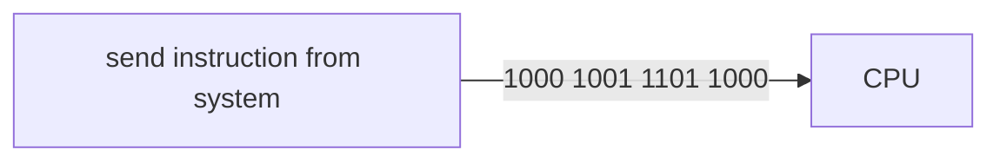
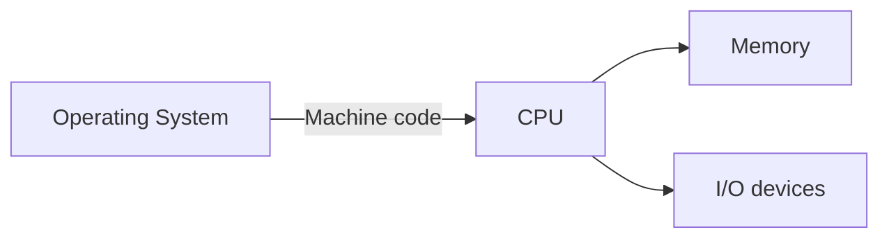
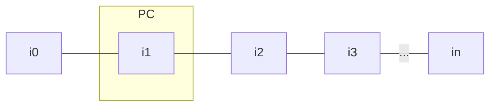
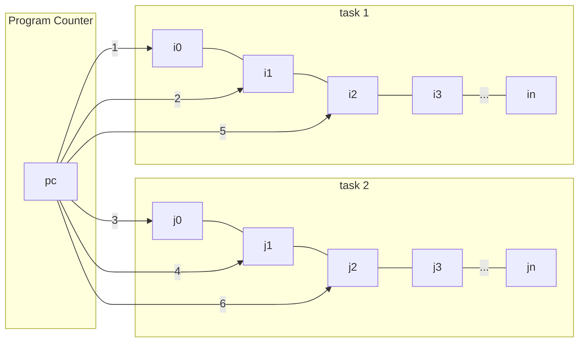
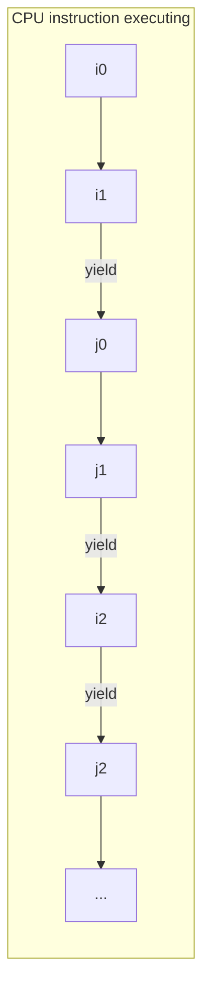
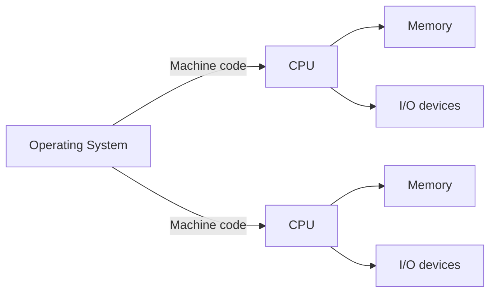
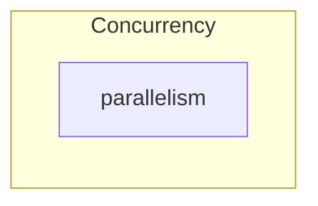
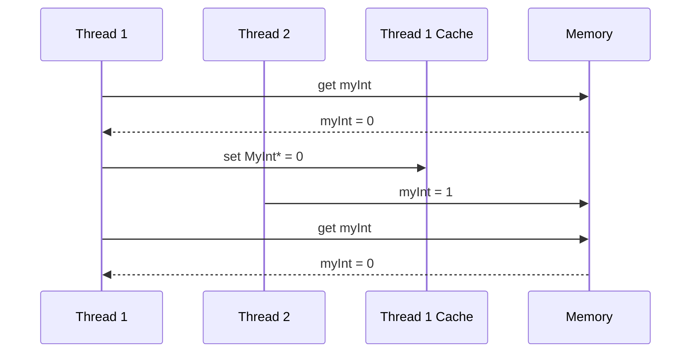
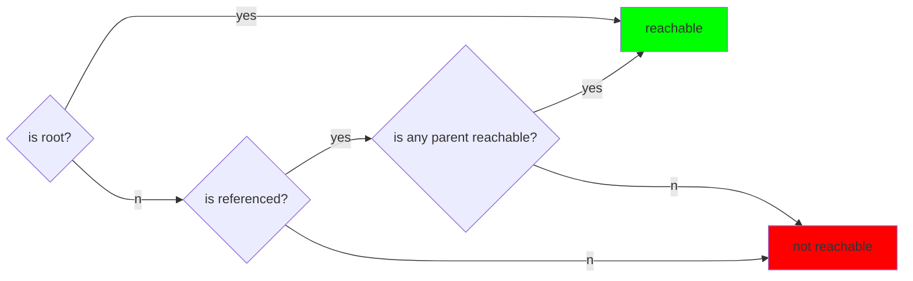

## Threading

### CPU Operations basics

"Move the content of register (CPU internal storage) BX into register AX"

**System** = CPU + Operating System

#### Single-Tasking system

execute the machine code of one single task until the task terminates.
It's not used in most popular systems.

- i0 - instruction
- PC, program counter - moves from one instruction to another

#### Cooperative multi-tasking system

**yielding** - releasing the CPU by the task. It allows other task to start using the CPU

Pros:

- allows concurrent execution of multiple tasks as yieldingly can happen thousands of ime on one second.
  Cons:
- one misbehaving task can claim resources for long time thus making the entire system unresponsive

#### Preemptive multitasking system

Similar to cooperative, but it's Operating system that is responsible for yielding the tasks based on algorithm
Pros:

- allows concurrent tasks
- guarantees system responsiveness
  cons:
- very complex system in the terms of creation. Used by majority of general purpose Operating Systems e.g. Android

### Multiprocessing system

System with more than one CPU

Pros:
Allows for parallelism

## Multithreading

decomposition of app logic into multiple concurrent tasks

concurrency - tasks <u>appear</u> to run at the same time
parallelism - tasks to at the same time

### I. Visibility problem

Having 2 threads, system can decide that particular thread don't need to access filed from memory,
rather it can use value from cache. System does it for performance improvements.
This can lead to situation where another thread is updating the value of the filed
but first thread is not reading updating value but reads value from cache.

### II. Atomicity problem

Multiple threads read the same value from memory e.g. `myInt = 3`,
and increment it because each thread had the same value at the beginning the new value is 4
instead of 3 + n, (where n is the number of threads). 
**When thread is doing "read, modify, write" non-other thread can access the same instance**
otherwise we have race condition.

`atomic` values = guarantees that only one thread can "read, modify, write" at the given time,
all others threads have to wait, but it does not guarantee that thread will not cache the value!

`volatile` && `final` keywords in java makes sure that thread will read and write value from memory.
**Though it doesn't solve the atomicity problem**

`synchronized` - allows to handle "race condition".
In case of "race condition" you are not guarantee the order in which particular statements will be run.
When 2 threads are having `synchronized`even when the order will be changed,
you are guaranteed that once the thread no. 1 finishes execution on synchronised
only then thread no. 2 will be able to execute the code.
Metaphor - taking stick only the one that is currently holding the stick is able to talk,
all the others have to wait. This is exactly the `Lock` "monitor" object.
Only one thread at a time can hold it: `synchronized` (Lock) 

Pros and cons of `synchronized`:

- Guarantees atomicity and visibility
- it's very complex, and it's easy to make a mistake
- performance as it blocks other threads, though it's not always significant
  (depends on the environment not really important on Android)
- -/+ it does not guarantee who will be next holder of monitor (it can be same thread)

### Happens-Before

If 2 actions can have happens-before relationships if:
First action happens before second and first visible and ordered before second action
It is lower level concept than "visibility".
Visibility is a function of established (or not) happens-before relationships between actions.

Why we need happens-before?
Even though we write our code ordered.
In reality there is no guarantee of sequence when we have multithreading.
Compilers, JVM or CPU can reorder sequence, unless we define the constraints e.g. happens-before.

Rule:

1. if only 1 thread then order in code will be respected
2. if action `x` synchronizes* with action `y`
3. Everything before `thread.start()` is visible for thread.

*
    - includes: `synchronized` keyword, read and write `volatile`s, `java.util.concurrent`

If we have `volatile` filed (which guarantees that thread will read value from memory)
and later call to `thread.start()` we have happens-before relation.
Therefore, thread will always be checking for the value of the variable in the memory.

### Garbage Collector, GC**

System process which automatically reclaims memory by discarding objects
that are no longer in use (not reachable)

Object reachability flow:

**Circular Reference**

Garbage Collector is able to recognize circular reference and knows that both object are not reachable,
hence it will release memory for myObject1 and myObjet2

### Memory Leaks

object that is no longer used but can't be Garbage Collected

**Roots** - object which are always consider by GC as reachable thus never cleaned by GC