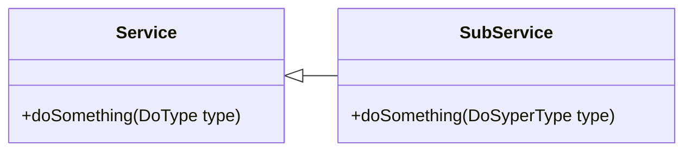
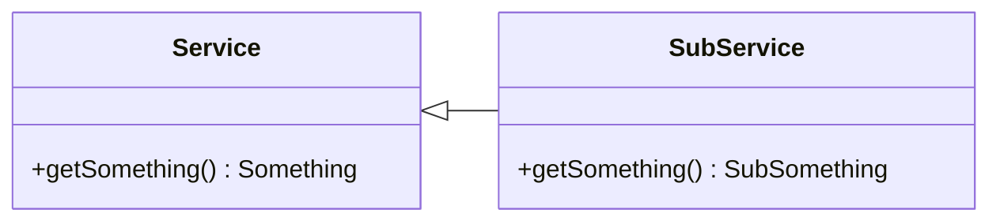
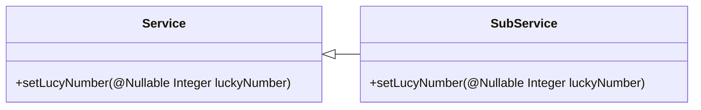
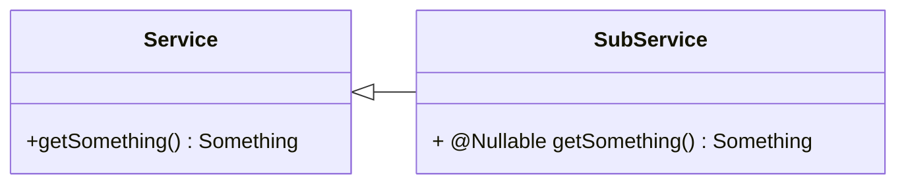
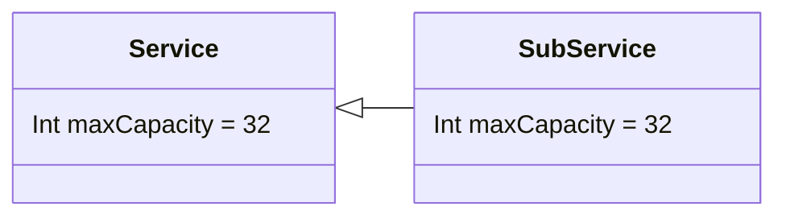

# SOLID principles

## Single Responsibility Principal

each entity should have on reason to change

how to approach:

1. Take features that you want to provide
   e.g. display a list of cats with images
2. Imagine that all code is in single File
3. Think about what would happen if business would require change:
    - support list of dogs as well
    - support different format (e.g. GIF)
    - support caching
    - adding to favorites (and displaying favorite animals)
    - search by type
    - adding your own picture of cat
4. If more than 1 of required changes is probable then the entity would break SRP
5. Therefore, functionalities should be extracted to separate entities.
6. It's worth extracting the code even if we don't expect any changes but expect re-usage of code in different entity.

## Open-Close Principal

Entity should be open for extension and close for modification

We can achieve it by providing proper abstraction, therefore practical definition is:

"Open-Close Principal depends on stable abstraction and modifies system's behaviour by providing different realizations"

1. Take a feature that you want to add.
   e.g. display a list of dogs and cats with images
2. Think what is going to happen to entity if you would like to display new types of animals
3. If adding new type requires modifying entity for proper handling all animals: e.g. dogs, cats, bats, rats it breaks
   the OCP
4. The proper way of handling: creating proper abstraction that will be used inside entity like `animal` which will be
   extended by all subtypes.
5. Each implementation of "animal" is going to provide proper functionality on its own

To check: "strategy" design patter, "abstract factory" pattern.

## Liskov Substitution Principle

Subtype to be named as a **real** subtype of a type, needs to fulfill certain rules.

### Method Signature rules

Those rules don't apply for statically type languages as they are force by compiler by default

1. Contravariant of arguments
    - same number of arguments
    - on subtype side argument passed can be only type or supertype of type in parent.

`Zebra`  is passing an `Number` to Animal, and it must work the same as in Parent the `Int`

2. Covariance of result
    - either both type and subtype returns the result or neither does
    - If there is as a result then result in subtype is type or subtype in Parent

3. Exception Rule
   Subtype should throw only same `Exception` and its sub`Exception`s that are handed by superclass

### Method Pre-condition and Post-condition rule

1. Precondition Rule - subclass should be able to operate in all states that a superclass can.
   e.g. handling nullability

2. Post condition Rule - Subclass can't have a weaker "states" than type
   e.g. returning null in below case

### Class Property Rule

1. Invariant rule - invariants guaranteed by a subclass must include all invariants guaranteed by a superclass
   e.g. the capacity of "DuplicatedQueue" that duplicates whatever is there has to have the same maxCapacity as
   superType.

2. Constraint rule - constraints in superclass must be included in subtype
   invariant is same for all instances of a calls while constraints are per instance.
   e.g. max capacity for queue is constraint as long as is se in constructor.
   If it's fixed and not set then it's invariant.

## Interface Segregation Principle

It's principle of the least knowledge and information hiding. Restricts what client can do with their services.
Clients should not be forced to implement interfaces they don't use. Instead, those interfaces should be split into
smaller, more specific interfaces. This makes the system more flexible, maintainable, and extensible.

Instead of having an interface with different methods (hence functionalities) in one Big Interface it's better to have
couple smaller per feature.

example to illustrate this principle:
Suppose we are building a system for managing a library. The system has an interface called LibraryItem that defines
methods for checking out and returning books, as well as methods for checking out and returning movies.

However, not all clients need to use all of these methods. For example, a client that only deals with books may not need
the methods for checking out and returning movies.

Without following the Interface Segregation Principle, the client would be forced to implement all of the methods in the
LibraryItem interface, even if they don't use some of them. This would make the system inflexible and difficult to
maintain.

Instead, we can follow the Interface Segregation Principle and split the LibraryItem interface into two smaller, more
specific interfaces: Book and Movie. This allows clients to implement only the methods they need, and makes the system
more flexible and maintainable.

pros:

- explicit and clear dependencies between client and service -> client knows what feature it's really needs and is
  restricted of using different ones.
- readability - no empty methods -> if not used. e.g. `TextChangeLister` from Android SDK is breaking ISP because it
  provides more methods than often required.
- easier to find clients that are using specific functionality -> e.g. when you're looking for a bug
- Safe and easy to add new messages - you don't need to change xx clients when new feature/ method is added
  (yes/no because without using the interface at all it would give same result, but it's not what we want)

## Dependency Inversion Principle

High level module should not depend on low level module. Both should depend on abstraction and abstraction should not
depend on details.
Details should depend on abstraction.

Benefits:

- usability
- flexible
- maintainable
- breaking dependency on external modules

Here is an example to illustrate this principle:

Suppose we are building a system for managing a shopping cart. The system has two modules: a low-level module for
storing the items in the cart, and a high-level module for calculating the total price of the items in the cart.

Without following the Dependency Inversion Principle, the high-level module would directly depend on the low-level
module. This would make the system inflexible, because if we wanted to change the way the items are stored (for example,
switching from a database to a file system), we would have to change the high-level module as well.

Instead, we can follow the Dependency Inversion Principle and create an abstraction for the storage of the items. This
could be an interface that defines a method for storing and retrieving items. Both the low-level and high-level modules
would depend on this abstraction, rather than depending on each other directly.

This decouples the modules from one another and makes the system more flexible. If we want to change the way the items
are stored, we can simply implement the storage interface in a different way, without having to change the high-level
module. This makes the system easier to maintain and extend.